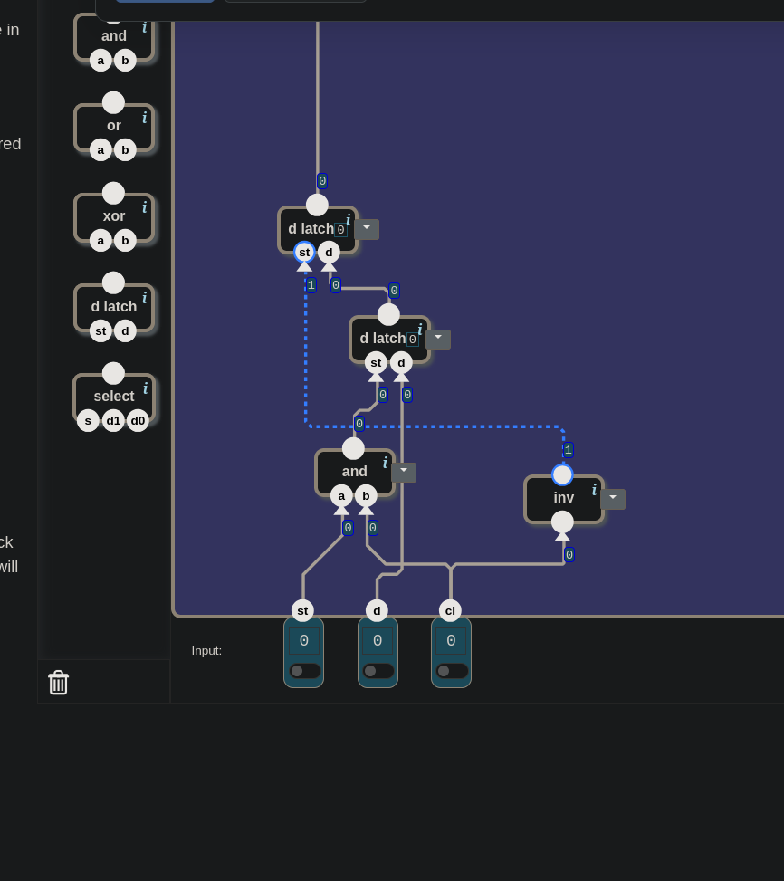

# 🧮 From Switches to a Computer — Data Flip-Flop: Receiver and Showcase

> In this level the first attempt failed. Both parts of the circuit were in the
> right place; the only thing missing was one gate. Why that gate is required
> became clear when the game's error message was read line by line. Then the same
> circuit was rebuilt with fewer nands, and the wiring got lost twice along the
> way.

---

## 📋 Table of Contents

- [What Does This Part Do?](#what-does-this-part-do)
- [Where Did We Leave Off?](#where-did-we-leave-off)
- [The Clock: Everyone Listens to the Same Bell](#the-clock-everyone-listens-to-the-same-bell)
- [What Can't the D Latch Do?](#what-cant-the-d-latch-do)
- [How Many Bits at Once?](#how-many-bits-at-once)
- [Receiver and Showcase](#receiver-and-showcase)
- [When Is Each Gate Open?](#when-is-each-gate-open)
- [The First Attempt Failed](#the-first-attempt-failed)
- [The Glass Is Back](#the-glass-is-back)
- [Are and and inv Each Other's Inverse?](#are-and-and-inv-each-others-inverse)
- [🎮 Now You Build It](#-now-you-build-it)
- [When the Boxes Are Opened](#when-the-boxes-are-opened)
- [Undefined at Power-On Again](#undefined-at-power-on-again)

---

## What Does This Part Do?

You are at the third door of the Memory unit. The landscape:

```
inputs:    st · d · cl   (1 bit each)
output:    1 bit
toolbox:   nand · inv · and · or · xor · d latch · select
```

Once again there is a new part in the toolbox: **`d latch`.** The circuit you
built in the previous lesson has been closed up and sits there as a single part.
There is also a new input: **`cl`.**

This time the level does not describe a table but a **sequence**:

| moment | what happens |
|---|---|
| `cl = 0` | `st` and `d` may change |
| as `cl` rises to 1 | if `st = 1`, the current value of `d` is **stored.** The output does **not change** yet. |
| as `cl` falls to 0 | the stored value is **given to the output** |

The effect of the inputs as `cl` rises to 1:

| st | d | effect |
|---|---|---|
| 1 | 0 | next = 0 |
| 1 | 1 | next = 1 |
| 0 | 0 | unchanged |
| 0 | 1 | unchanged |

Under it there are two notes: *"Output before the first store and clock cycle is
unspecified"* and *"Assume there will be no changes in input while cl=1."*

---

## Where Did We Leave Off?

At the end of [17](./17_d_latch.md#while-the-gate-is-open) a problem was left
open. The D Latch is **transparent**: as long as `st = 1`, the output follows `d`
instantly. When the PC was kept in D Latches and `PC ← PC + 1` was attempted,
the number kept growing for as long as the gate stayed open. What was wanted was
a single step.

The sentence there was: the computer does not need "for as long as the gate is
open", it needs **"exactly now, once."**

The window that opens with the level starts from the same place:

> *"Using latches, you can build a circuit that changes its state over time. But
> a problem appears then: since state changes are not synchronized across the
> circuit, changes ripple through the circuit in an unpredictable order, leading
> to **race conditions** and generally unpredictable results."*

You have seen these races: in [16](./16_sr_latch.md#the-unused-row) when leaving
`0 0`, and in 17 in the instant spike and in the selector latch. The solution the
window proposes: **a clock signal.**

---

## The Clock: Everyone Listens to the Same Bell

`cl` is the *clock.* A wire that keeps going 0, 1, 0, 1. In the game you flip it
by hand. Each back-and-forth is one **clock cycle.**

In this level the two inputs answer two different questions:

| input | the question it asks |
|---|---|
| `st` | **Should it be written?** The same permission as in the D Latch. |
| `cl` | **When?** Changes happen only to its rhythm. |

The idea is simple: if every memory part listens to the same bell, changes only
happen at the moment the bell rings. In between, wires may still race, but nobody
sees the result of that race. The outputs do not move.

Nobody watches the race or decides, one by one, who should come first. The race
still happens; it just **cannot be seen.**

---

## What Can't the D Latch Do?

The first question when looking at the table: *what does this level want that
the D Latch cannot do?*

What the D Latch does was first summarized correctly: there is an SR Latch
inside it, a translator has been put in front of it, and while `st = 1` it
translates the current value of `d` into the SR Latch's language and writes it.
But one thing was left out, and the answer is right there:

> 🔑 The D Latch **also gives it to the output** at the moment it writes.

From here on two words will come up often:

- **Taking:** storing the value of `d` inside. The value is now inside the
  circuit, but it cannot be seen from outside.
- **Showing:** giving the stored value to the output wire. If another circuit is
  connected to the output, only then does it see the value.

In the D Latch these two are one event: the moment it writes, the value is also
visible at the output. Here there are two separate moments:

| moment | D Latch | Data Flip-Flop |
|---|---|---|
| taking | while `st = 1` | as `cl` rises to 1 |
| showing | **while taking, at the same time** | as `cl` falls to 0, **later** |

Taking and showing have been separated.

---

## How Many Bits at Once?

Think it through with a concrete example:

1. The output is **0** right now. A value stored earlier.
2. `d = 1` and `st = 1` were set. `cl` rose to 1. According to the table, the 1
   was **taken.**
3. But the output must **not change** yet. It must still show 0.

### Why must the output wait?

Because other circuits look at the output, and their calculations often depend
on this very value. Remember the example from [17](./17_d_latch.md#while-the-gate-is-open):
`PC ← PC + 1`. The increment circuit reads the PC's output and feeds its result
back into the PC's `d`. If the output changed the moment the new value was
taken, the increment circuit would see the new value right away, increment it
again, and that would be taken right away too. The ever-growing counter from 17
would come back.

The flip-flop splits this into two steps. First the value **to be given to the
output is chosen** and held inside. Meanwhile the output keeps showing the old
value, and the circuits looking at it finish their work with the old value. When
the bell rings, the new value is given to the output in one go. The race still
happens, but its result reaches nobody.

### The price

At that moment the circuit has to remember two things at once: **the newly taken
1** and **the old 0 it is showing at the output.**

Can one D Latch hold two different bits at the same time? It cannot. But the
answer came right from there:

> *"If one D Latch holds one piece of data, two D Latches hold two."*

---

## Receiver and Showcase

Let's name the two latches by their roles:

- **Receiver:** the one that takes the newly arriving value.
- **Showcase:** the one that shows it at the output.

While building, this question came up: *does each latch need to know what the
other one holds?*

It does not. The conversation is not two-way; it is **a one-way handover.** When
`cl` falls to 0, the value in the receiver has to pass to the showcase. The
showcase does not look inside the receiver; **the receiver hands it a wire.**

Three wires come out of this:

```
the outside d          →  the receiver's d
the receiver's output  →  the showcase's d
the showcase's output  →  Output
```

In books this structure is called a *master–slave flip-flop*: the receiver is the
*master*, the showcase the *slave*.

---

## When Is Each Gate Open?

What is left are the `st` legs of the two latches: which gate is open when?

**The showcase.** The table says "show when `cl` falls to 0". So the showcase's
gate must be open while `cl = 0`. But a D Latch's gate opens when `st = 1`. You
need a wire that is 1 while `cl` is 0 and 0 while `cl` is 1:

```
the showcase's st  ←  inv(cl)
```

**The receiver.** The receiver has two conditions, and both must hold at the same
time: `st = 1` (write permission) **and** `cl = 1` (the clock at 1). The gate that
gives 1 only when both conditions are 1:

```
the receiver's st  ←  and(st, cl)
```

But this second part was missing in the first attempt.

---

## The First Attempt Failed

In the first circuit the showcase was right: its `st` on `inv(cl)`, its `d` on
the receiver's output. But the receiver's `st` was connected directly to the
outside `st`. `cl` played no part at all.


*The first attempt. The lower latch is the receiver, its `st` wired straight to the `st` input. The upper one is the showcase, its gate fed from `inv(cl)`.*

Check solution tried this sequence:

> 1. `d = 1` · 2. `st = 1` · 3. `cl = 1`, the output must not change yet ·
> 4. `cl = 0`, the stored 1 must be given to the output · 5. `d = 0` · 6. `cl = 1`
>
> *"Expected output to be 1 but was 0. Output should not be changed yet."*

Reading the message line by line showed what happened:

| step | state | what happened in this circuit |
|---|---|---|
| 4 | `cl = 0`, output 1 | ✓ |
| 5 | `d = 0` while `cl` is still 0 | the receiver was open (`st = 1`) and so was the showcase (`inv(0) = 1`): the 0 passed through both gates and reached the output |
| 6 | `cl = 1` | the game expected the output to still be 1, because a new value should only appear once the clock cycle is complete. The output had already become 0 in step 5. |

---

## The Glass Is Back

The problem: while `cl = 0`, **both gates were open.** At that moment there is an
unbroken path from `d` to the output, and the circuit behaves like a single D
Latch again. The glass it was meant to cover is back.

> 🔑 The flip-flop's secret: **the two gates must never be open at the same
> time.** The showcase is open while `cl = 0`. So the receiver has to be closed
> while `cl = 0`.

With `and(st, cl)` on the receiver's gate, the circuit passed:

> *"4 components used. 31 nand gates in total. This uses the fewest possible
> components. (But it is possible to solve with a lower total of nand-gates.)"*


*The circuit that passed. The lower receiver's gate now comes from `and(st, cl)`.*

Now `cl` drives the two gates in opposite directions:

| `cl` | receiver: `and(st, cl)` | showcase: `inv(cl)` |
|---|---|---|
| 1 | open (if `st = 1`) | closed |
| 0 | closed | open |

---

## Are and and inv Each Other's Inverse?

Once the circuit passed, another question came up: *does the output of `and`
behave like `inv`?*

The answer is "almost", and that small difference carries the circuit's secret.

**Yes, when `st = 1`.** `and(1, cl)` is simply `cl` itself, and `inv(cl)` is its
inverse. The wires of the two gates are exact inverses of each other.

**No, when `st = 0`.** `and` gives 0 in every case, so the receiver stays closed.
At the moment `cl = 1`, both gates are closed at once. So the two wires are not
always each other's inverse.

The real rule is not "always inverse" but something weaker that is still enough:

> 🔑 **The two are never open at the same time.** If one is open, the other is
> certainly closed. Both being closed at once is harmless: during that time the
> value is simply kept.

The result: the output changes only **at the moment `cl` falls from 1 to 0.**
Apart from that single moment, whatever `d` does, the output does not move. That
is the "exactly now, once" that 17 asked for, but only for **when** the output
changes.

> 📌 **Which** value is shown is decided by `d` at the end of `cl = 1`. The
> receiver's gate is open for the whole of `cl = 1`, so during that time it is
> transparent: if `d` changes then, the receiver follows it and the value at the
> fall is taken. In the sequence `st = 1`, `d = 1`, `cl = 1`, `d = 0`, `cl = 0` the
> output becomes 0, while the level's table expects 1. That is why the level has
> the note *"Assume there will be no changes in input while cl=1."*

---

## 🎮 Now You Build It

Parts list: **2 × `d latch`**, **1 × `and`**, **1 × `inv`**.

1. Place a `d latch`; this is the **receiver.** Connect the outside `d` to its `d`.
2. Connect `st` and `cl` to the two legs of `and`. Give its output to the
   receiver's `st`.
3. Place the second `d latch`; this is the **showcase.** Connect the receiver's
   output to its `d`.
4. Connect `cl` to `inv`. Give its output to the showcase's `st`.
5. Connect the showcase's output to `Output`.

### How to test the flip-flop

In each step **only one** switch changes:

| step | change | expected output | what is being tested |
|---|---|---|---|
| 1 | `d = 1` | undefined | |
| 2 | `st = 1` | undefined | |
| 3 | `cl = 1` | **unchanged** | 1 was taken but not shown |
| 4 | `cl = 0` | `1` | the cycle is complete, it was shown |
| 5 | `d = 0` | **`1`** | `d` is not heard while `cl = 0` |
| 6 | `cl = 1` | **`1`** | 0 was taken, not shown (the game's check caught the first attempt at this step; with this table the first attempt fails at step 5) |
| 7 | `cl = 0` | `0` | it was shown |
| 8 | `st = 0` | `0` | |
| 9 | `d = 1` | `0` | |
| 10 | `cl = 1` | **`0`** | the output does not change, the showcase is closed |
| 11 | `cl = 0` | **`0`** | `st = 0`: nothing was taken this cycle, the old value is kept |

Look at steps 5, 6 and 11. Those three rows are the flip-flop's proof.

<details>
<summary>🔑 Stuck? — connection list</summary>

```
and:                  a ← st              b ← cl
inv:                  ← cl
d latch (receiver):   st ← and output     d ← d
d latch (showcase):   st ← inv output     d ← receiver's output
showcase:             output  →  Output
```

Total: 4 components, 31 `nand`.

</details>

---

## When the Boxes Are Opened

The game counts two different things: **components** and **nands.** Four
components is the minimum for components. But fewer nands are possible.

Look at where the 31 comes from. In the solution you are about to see, the game
counts `and` and `inv` together as 5 nands. The remaining 26 belong to the two
`d latch` boxes: 13 per box. Yet the D Latch you built in 17 was 4 nands, and the
game said that was optimal.

Try it yourself first. Hint: **don't use the boxes.** Build both latches from
nands yourself. There is no `sr latch` in the toolbox; you will build that part by
cross-connecting two nands as in [16](./16_sr_latch.md).

With many wires it is very easy to get lost. The wiring got lost twice while this
solution was being built. What helped: splitting the canvas into **two columns**
(receiver on the left, showcase on the right), and in each column putting **the
translators on the bottom row and the SR Latch on the top row.**

<details>
<summary>🔑 Answer — the circuit without boxes</summary>

Each column is the same 4-nand D Latch from 17. The only thing that changes is
where its gate (`en`) and its data (`d`) come from:

| column | gate (`en`) | data (`d`) |
|---|---|---|
| receiver | `and(st, cl)` | the outside `d` |
| showcase | `inv(cl)` | the receiver's output |

Inside each column are the same four nands:

| nand | `a` | `b` | role |
|---|---|---|---|
| 1 | `en` | `d` | translator |
| 2 | `en` | output of nand 1 | translator |
| 3 | output of nand 1 | output of nand 4 | SR, **the column's output** |
| 4 | output of nand 2 | output of nand 3 | SR |

The receiver's nand 3 goes to the showcase's `d`, and the showcase's nand 3 to
`Output`.

> *"10 components used. 13 nand gates in total. This is optimal!"*


*The solution without boxes. The window on the right also shows the list of Memory levels.*

</details>

The resulting table:

| solution | components | nands | what the game says |
|---|---|---|---|
| two `d latch` boxes | **4** | 31 | fewest components |
| boxes opened | 10 | **13** | *"This is optimal!"* |

The second solution is more work to build but smaller. **Boxes are for people,
nands are for chips.** For you, wiring two boxes is easy. On a chip, every nand is
real transistors, real area, real power. The ladder in
[03.5](./03.5_soyutlama_merdiveni.md) works in the other direction here too:
working higher up is easy, the price is paid at the very bottom.

> 📌 Before this solution was tried, the target was thought to be 11 nands
> (assuming `and` counts as 2 and `inv` as 1). The game counted 13. How many
> nands the game counts for a box should not be guessed; it should be measured.

Opening the boxes carries one more risk. In 17 the selector latch passed as a
black box, and lost the bit once it was opened up: the box had been hiding the
race inside it. The same question was asked here. This circuit was simulated at
gate level 400 times, with each nand given a different delay between 1 and 3
ticks (the simulation's unit of time). In the 9,851 steps after the first showing
(the first fall after a store), no wrong or unstable output was seen.

The reason is the rule above: the two gates are never open at the same time. The
result of a race can only reach the output while both ends of the path are open.

---

## Undefined at Power-On Again

In the simulation, instability showed up in only one place: **before the first
showing**, for some power-on states. Each of the two SR Latches wakes up in one of
two equally stable states, as in [16](./16_sr_latch.md), or with some delays
flickers for a while. The level's note says the same: *"output before the first
store and clock cycle is unspecified."*

The clock made races invisible, but it did not solve the moment of power-on. Its
name was given in 16: [CWE-1271](../cwe/cwe_1271.md), a security bit whose value
is not set at power-on. The solution is the same too: a security-related bit must
be forced to a known value at power-on, while reset is still active.

### Next up

**Register.**

---

## Summary — Keep in Mind

```
☐ The toolbox now has d latch: the previous lesson's circuit was closed up. New input: cl (clock).
☐ st is "should it be written", cl is "when". Two separate questions.
☐ The clock idea: everyone listens to the same bell, changes happen only when it rings. Races still happen but their result cannot be seen.
☐ 🔑 The D Latch also gives the value to the output the moment it writes (transparent). The flip-flop SEPARATES taking and showing.
☐ Taking = storing the value inside. Showing = giving the stored value to the output wire.
☐ As cl rises to 1: if st = 1, d is taken, the output does not change. As cl falls to 0: what was taken is shown.
☐ 🔑 Why the output waits: so the circuits looking at it (like PC + 1) finish their work with the old value. The new value is chosen first and given to the output in one go when the bell rings.
☐ At the moment of "taken but not shown", the circuit holds TWO bits: newly taken + old shown → two D Latches.
☐ The receiver and the showcase do not know each other: a one-way handover. Receiver's output → showcase's d.
☐ The showcase's gate is inv(cl): open while cl = 0.
☐ The receiver's gate is and(st, cl): both conditions at once, permission AND cl = 1.
☐ ⚠️ First attempt: the receiver's gate had only st. With cl = 0 both gates were open → an unbroken path from d to the output → the circuit was transparent again. Check failed at step 6.
☐ 🔑 The two gates must NEVER be open at the same time. Both being closed at once is harmless.
☐ With st = 1, and(st, cl) and inv(cl) are inverses of each other; with st = 0 they are not. The rule is not "always inverse" but "never both open".
☐ Result: the output changes only AT THE MOMENT cl falls from 1 to 0. The "exactly now, once" that 17 wanted.
☐ 📌 Which value is shown is decided by d at the end of cl = 1: the receiver is transparent for the whole of cl = 1. That is why the level assumes the inputs stay fixed while cl = 1.
☐ Testing memory is a SEQUENCE: one switch per step. The proof rows: with cl = 0, d changes and the output doesn't; when cl rises to 1, the output still doesn't change; with st = 0 the old value stays at the fall.
☐ The game counts two things: components and nands. 4 components / 31 nands ≠ 10 components / 13 nands (optimal).
☐ The d latch box counts as 13 nands in the game; your own D Latch from 17 is 4. Opening the boxes lowers the nand count.
☐ 🔑 Boxes are for people, nands are for chips. The laborious solution is often the small one.
☐ ⚠️ Don't guess how many nands the game counts for a box; measure it.
☐ Does opening the boxes create a race? Not in the simulation: because the two gates are never open at the same time.
☐ 👾 Still undefined at power-on: the clock doesn't solve CWE-1271. A security bit must be forced to a known value while reset is active.
```

---

## 🔗 Related Topics

- [17_d_latch.md](./17_d_latch.md) — The transparent latch and the need for "exactly now, once"; each of the flip-flop's two halves
- [16_sr_latch.md](./16_sr_latch.md) — The cross-coupled nand pair built twice in the solution without boxes
- 👾 **What the clock makes invisible:** [CWE-1298](../cwe/cwe_1298.md) — two paths from the same wire racing
- 👾 **What the clock does not solve:** [CWE-1271](../cwe/cwe_1271.md) — a security bit whose value is not set at power-on
- [03.5_soyutlama_merdiveni.md](./03.5_soyutlama_merdiveni.md) — Boxes are for people, nands are for chips
- [13_arithmetic_unit.md](./13_arithmetic_unit.md) — `PC ← PC + 1`: the line where 17's transparent latch problem came from

---

**Previous topic:** [17_d_latch.md](./17_d_latch.md)
**Next topic:** [19_register.md](./19_register.md)
