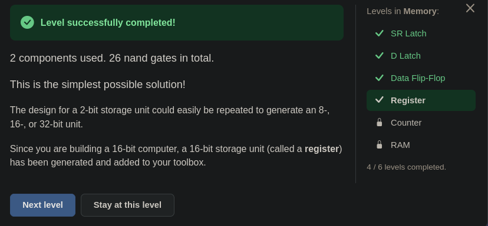

# 🧮 From Switches to a Computer — Register: The Memory of a Number

> The circuit built in this level is small: two parts. But two questions were
> asked before building it. One was whether a single clock wire driving two parts
> at once would create a new race. The other was whether `st` pairs up with each
> bit's own `d`. The answers to both are what this level is really about.

---

## 📋 Table of Contents

- [What Does This Part Do?](#what-does-this-part-do)
- [The Memory of a Number](#the-memory-of-a-number)
- [Data Wire, Control Wire](#data-wire-control-wire)
- [Why All at Once?](#why-all-at-once)
- [Shared or Separate?](#shared-or-separate)
- [One Bell, Do the Boxes Race?](#one-bell-do-the-boxes-race)
- [🎮 Now You Build It](#-now-you-build-it)
- [Sixteen Bits](#sixteen-bits)

---

## What Does This Part Do?

You are at the fourth door of the Memory unit. The landscape:

```
inputs:    st · d1 · d0 · cl   (1 bit each)
outputs:   d1 · d0             (1 bit each)
toolbox:   nand · inv · and · or · xor · dff
```

Once again there is a new part in the toolbox: **`dff`.** The Data Flip-Flop you
built in the previous lesson has been closed up and sits there as a single part.

The level's definition is one sentence: *"A 2-bit DFF component works like a data
flip-flop, except two bits (`d1` and `d0`) are stored and emitted instead of
one."*

The window that opens says:

> *"You can now store a single bit of data. In this mission you have to combine
> two data flip-flops (DFFs) to store and retrieve **two** bits of data in **one
> operation**. (Ultimately we want to store and retrieve 16-bit words at a time,
> but if you figure out how to store two bits, storing larger sets is trivial.)"*

---

## The Memory of a Number

Until now memory has always been **a single bit.** SR Latch, D Latch, Data
Flip-Flop: each held one wire.

But a computer does not work with single bits. In [04](./04_teller_sayi_olunca.md)
you learned to put several wires side by side and read them as **a single
number.** In the ALU you carried 16 wires together.

**A register is the memory of that number.** A part that holds several bits as
one whole. The word **word** in the window is the name of that whole: bits that
are carried together and stored together.

Processor registers like `AX`, which you may have heard of in assembly, are a
wider version of this structure.

> 📌 Don't mix up two words here. A **bit** is a unit: the smallest piece of
> information a wire can carry, 0 or 1. **Data** is the content made of those
> units. A single bit can be data, and so can a 16-bit number. "The SR Latch holds
> one piece of data" is vague. The accurate version: "the SR Latch holds 1 bit of
> data"; a register holds 2 (or 16) bits.

---

## Data Wire, Control Wire

The inputs have familiar names, but they fall into two separate groups:

| input | what it carries | how many |
|---|---|---|
| `d1`, `d0` | **data:** the bits of the number to be stored | one per bit |
| `st`, `cl` | **control:** "should it be written" and "when" | one for the whole word |

**The names `d1` and `d0` come from place value.** `d0` is the rightmost bit, the
ones place. `d1` is the one to its left, the twos place. Together they make a
number from 0 to 3:

```
d1 d0
 0  0   = 0
 0  1   = 1
 1  0   = 2
 1  1   = 3
```

**`st` and `cl` mean what they meant in the previous lesson.** The only change is
that they now give orders not to a single bit but to **the whole word.**

You have seen this distinction before. In [14](./14_alu.md#data-bits-and-control-bits)
the ALU's control word gave **the same** order to all 16 bits, while the data was
separate in each bit. The sentence from there holds here too: there is no
physical difference between a control bit and a data bit; the difference is
**where the wire is connected.**

---

## Why All at Once?

The window says "store two bits **in one operation**". An example shows why this
matters.

The register holds `01` (1). `10` (2) is written into it. Both bits change: `d1`
goes from 0 to 1, `d0` from 1 to 0.

If these two bits changed **at different moments**, what would someone looking at
the output see in between?

```
if d1 changes first:   01  →  11  →  10       3 appears in between
if d0 changes first:   01  →  00  →  10       0 appears in between
```

A number nobody wrote shows up at the output for an instant. One of the bits is
right, but the number is wrong.

In [18](./18_data_flip_flop.md#why-must-the-output-wait) the question was why the
output must wait. Here there is one more step: not even a single bit may get its
timing wrong. **All the bits must change on the same bell.**

---

## Shared or Separate?

Two `dff`s will be placed. Each has three legs: `st`, `d`, `cl`. Six legs in
total. The question: which of them are **shared** by both `dff`s, and which are
**separate**?

`cl` was found first: one bell, to both `dff`s at once. Then the `d`s: `d1` to one
`dff`, `d0` to the other. Each bit reads its own `d`.

With `st` there was a mix-up. It was assumed that `st` was split bit by bit too,
with `st1` pairing with `d1` and `st0` with `d0`. But looking at the inputs, this
level has **a single `st`.** `st` is the "should it be written" order not for one
bit but for the whole word.

The source of the mix-up is understandable: there really is a place where `st`
and `d` come together, but it is **inside the box**, and in one place only: the
translator of the receiver latch from
[18](./18_data_flip_flop.md#when-is-each-gate-open) (the translator from
[17](./17_d_latch.md)). Even there `st` does not arrive directly but through
`and(st, cl)`; the showcase never sees `st`. From the outside, the `dff`'s legs
are separate: `st` is an order, `d` is data. Combining them is the box's own job.

| leg | where it goes |
|---|---|
| `st` | **shared** by both `dff`s |
| `cl` | **shared** by both `dff`s |
| `d1` | only the first `dff` |
| `d0` | only the second `dff` |

> 🔑 **Control wires are shared, data wires are separate.** That table is the
> whole idea of this level.

---

## One Bell, Do the Boxes Race?

`cl` going to both `dff`s at once raised a question: wouldn't one signal driving
two parts at once lead to a race again?

To answer it, go back to the definition of a race. In
[CWE-1298](../cwe/cwe_1298.md) the definition was: **two paths from the same
source meet at the same gate**, and the result depends on which one arrives first.

Here the two paths of `cl` **never meet anywhere.** One goes to one `dff`, the
other to the other. The two `dff`s are not connected to each other; neither
listens to the other's output. Each takes only its own `d`, and by the game's rule
those `d`s do not change while `cl = 1`.

So even if the bell reached one of them a moment late, both would take **the same
steady value.** The result does not depend on who comes first. The structure
MITRE describes does not arise. And in the game the wire is ideal anyway: the
bell reaches both at the same moment.

On a real chip, if the bell reaches one of them a moment late, `11` or `00` shows
up at the output for a moment, but the circuit looking at the output also takes
the value only at the next bell, and by then both bits have settled.

---

## 🎮 Now You Build It

Parts list: **2 × `dff`**.

1. Connect `st` to the `st` leg of both `dff`s.
2. Connect `cl` to the `cl` leg of both `dff`s.
3. Connect `d1` to the first `dff`'s `d`, and `d0` to the second one's `d`.
4. Connect the first `dff`'s output to Output `d1`, and the second one's to
   Output `d0`.

Output also has **two** indicators, small and side by side. Don't miss them.

### How to test the register

In each step **only one** switch changes:

| step | change | expected output `d1 d0` | what is being tested |
|---|---|---|---|
| 1 | `d0 = 1` | undefined | |
| 2 | `st = 1` | undefined | |
| 3 | `cl = 1` | **unchanged** | `01` taken, not shown |
| 4 | `cl = 0` | `0 1` | both bits shown together |
| 5 | `d1 = 1` | **`0 1`** | data is not heard while `cl = 0` |
| 6 | `d0 = 0` | **`0 1`** | |
| 7 | `cl = 1` | **`0 1`** | `10` taken, not shown |
| 8 | `cl = 0` | `1 0` | both bits changed **at the same time** |
| 9 | `st = 0` | `1 0` | |
| 10 | `d1 = 0` | `1 0` | |
| 11 | `cl = 1` | `1 0` | the output does not change, the showcase is closed |
| 12 | `cl = 0` | **`1 0`** | `st = 0`: nothing taken this cycle, the old number is kept |

Look at step 8: both bits changed, and both appeared in the same step.

<details>
<summary>🔑 Stuck? — connection list</summary>

```
dff (bit 1):  st ← st    d ← d1    cl ← cl    →  Output d1
dff (bit 0):  st ← st    d ← d0    cl ← cl    →  Output d0
```

Total: 2 components, 26 `nand`.

</details>

The game's answer:

> *"2 components used. 26 nand gates in total. This is the simplest possible
> solution!"*


*Register passed. In the list on the right, the fourth level of the Memory unit is checked.*

Note the 26: two `dff`s, **13** nands each. The optimal count reached by opening
the boxes in [18](./18_data_flip_flop.md#when-the-boxes-are-opened). The game
counts the `dff` box as that best solution.

---

## Sixteen Bits

When the level is done, the game says one more thing:

> *"The design for a 2-bit storage unit could easily be repeated to generate an
> 8-, 16-, or 32-bit unit. Since you are building a 16-bit computer, a 16-bit
> storage unit (called a **register**) has been generated and added to your
> toolbox."*

You now know what is inside: 16 `dff`s side by side. `st` and `cl` are shared by
all sixteen, and every bit from `d0` to `d15` comes in on its own path and goes
out on its own path. The table you built for two bits grows to sixteen rows; the
idea does not change.

This is one more step on the ladder from [03.5](./03.5_soyutlama_merdiveni.md):
what you built is closed up and becomes a single part.

### Next up

**Counter.**

---

## Summary — Keep in Mind

```
☐ The toolbox now has dff: the previous lesson's circuit was closed up.
☐ Register = the memory of a NUMBER. Bits stored together are called a WORD.
☐ A bit is a unit (0 or 1), data is the content. The SR Latch holds 1 bit of data, a register 2 (or 16) bits.
☐ The names d1 and d0 come from place value: d0 is the ones place, d1 the twos. d1 d0 together make 0–3.
☐ 🔑 Data wires (d1, d0) are SEPARATE per bit. Control wires (st, cl) are SHARED by the word.
☐ There is no physical difference between a control bit and a data bit; the difference is where the wire is connected (14).
☐ Why in one operation: if the bits change at different moments, a number nobody wrote appears (01 → 11 or 00 → 10).
☐ ⚠️ st is not split bit by bit; there is one st. The place where st and d meet is INSIDE the dff box: only the receiver's translator, and st reaches it through and(st, cl).
☐ One cl driving two dffs is not a race: the two paths of cl NEVER MEET at a gate, and each dff takes its own steady d.
☐ Solution: 2 components, 26 nands, the simplest. The dff box is 13 nands = the optimum from 18.
☐ The game generated a 16-bit register box: 16 dffs, st and cl shared, d0–d15 separate.
```

---

## 🔗 Related Topics

- [18_data_flip_flop.md](./18_data_flip_flop.md) — Each bit of the register; "why must the output wait?"
- [14_alu.md](./14_alu.md) — Data bits and control bits; the control word gives the same order to all 16 bits
- [04_teller_sayi_olunca.md](./04_teller_sayi_olunca.md) — Several wires, one number; place value
- [17_d_latch.md](./17_d_latch.md) — The translator where `st` and `d` meet inside the box
- 👾 **The definition of a race:** [CWE-1298](../cwe/cwe_1298.md) — two paths from the same source, when they meet at the same gate
- [03.5_soyutlama_merdiveni.md](./03.5_soyutlama_merdiveni.md) — Closing up what you built and stepping on top of it

---

**Previous topic:** [18_data_flip_flop.md](./18_data_flip_flop.md)
**Next topic:** [20_counter.md](./20_counter.md)
