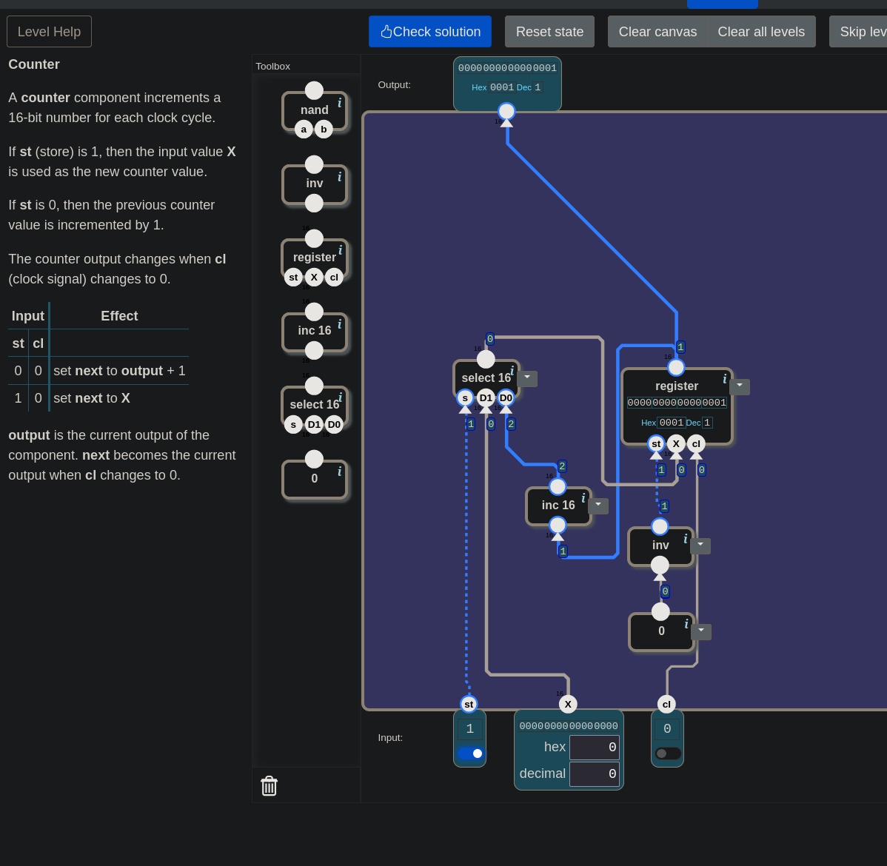

# 🧮 From Switches to a Computer — Counter: One Step per Bell

> This level was solved question by question. Along the way there were two
> places where it paused and went back: what `inc 16` does had been forgotten,
> and wiring a constant `0` to the register's write leg was suggested. Both
> opened the way to the level's real idea: two wires with the same name do not
> do the same job.

---

## 📋 Table of Contents

- [What Does This Part Do?](#what-does-this-part-do)
- [An Old Debt](#an-old-debt)
- [Who Holds the Number?](#who-holds-the-number)
- [The Candidates](#the-candidates)
- [Same Name, Different Job](#same-name-different-job)
- [When Should the Register Write?](#when-should-the-register-write)
- [The Loop Now Turns Once](#the-loop-now-turns-once)
- [🎮 Now You Build It](#-now-you-build-it)
- [Is There Another Solution?](#is-there-another-solution)

---

## What Does This Part Do?

You are at the fifth door of the Memory unit. The landscape:

```
inputs:    st (1 bit) · X (16 bits) · cl (1 bit)
output:    16 bits
toolbox:   nand · inv · register · inc 16 · select 16 · 0
```

There is a new part in the toolbox: **`register`.** You built its two-bit
version in the previous lesson; the game widened it to 16 bits and put it in the
toolbox.

The level's definition:

> *"A counter component increments a 16-bit number for each clock cycle. If `st`
> (store) is 1, then the input value `X` is used as the new counter value. If
> `st` is 0, then the previous counter value is incremented by 1. The counter
> output changes when `cl` (clock signal) changes to 0."*

| `st` | written to the register |
|---|---|
| 0 | **output + 1** |
| 1 | **`X`** |

The game's table uses two words. **output** is the current output. **next** is the next
value: the one that will pass to the output when `cl` falls to 0.

The window that opens also says:

> *"The next task is to build a counter which increments a number at each clock
> cycle. Counters are a core component in a processor because they drive the
> execution of instructions."*

---

## An Old Debt

You know this line from [13](./13_arithmetic_unit.md):

```
PC ← PC + 1
```

In [17](./17_d_latch.md#while-the-gate-is-open), when this line was built with a
transparent latch, the number kept growing **without stopping.** For as long as
the gate stayed open, the incremented value was written back right away,
incremented again, written again. In
[18](./18_data_flip_flop.md#why-must-the-output-wait), when the question "why
must the output wait?" came up, the example was this one again.

This level actually builds that counter. This time it will increase **once** per
bell.

---

## Who Holds the Number?

The first question: which part **holds** the number in this circuit, and where
should the next value come from?

The answer came quickly: the **`register`** holds the number. The next value
should come from **`select 16`**, because the table has two candidates and the
level's `st` chooses which one passes.

---

## The Candidates

**First candidate: `X`.** It comes from outside, ready.

**Second candidate: output + 1.** The part that produces it is **`inc 16`**.

Here there was a moment of doubt: *"Did `inc 16` widen one bit to 16 bits?"* No.
This is the Increment level from [08](./08_increment.md): a 16-bit number goes
in, and that number plus one comes out.

```
inc 16:   0005  →  0006
          ffff  →  0000     ← the "counter wraps" from 08.5
```

This also shows that the counter has a limit: after 65535 it goes back to 0
([08.5](./08.5_sayac_basa_donunce.md)).

"The output" is the register's output. That wire goes both to Output and to the
input of `inc 16`. The same wire can be connected to two places at once.

**The selector.** The rule from [11](./11_selector_switch.md): while `s = 1`,
`D1` passes; while `s = 0`, `D0`. Since the table asks for the incremented number
when `st = 0`:

```
select 16:   s ← st     D1 ← X     D0 ← output of inc 16
```

---

## Same Name, Different Job

When it came to the register's legs, a question came up: *"Should the level's
`st` be connected to the register's `st`?"*

No. The two wires carry the same name but do not do the same job:

| wire | the question it asks |
|---|---|
| the level's `st` | **Which candidate?** `X` or output + 1? It goes to the selector. |
| the register's `st` | **Should it be written?** The write permission from 18. |

The level's `st` is really a **selection wire.** Its name may be "store", but here
it does not decide whether something is stored, it decides **what** is stored.

> ⚠️ Same name, two different things. Read a wire not by its name but by **where
> it is connected.** The sentence from [14](./14_alu.md#data-bits-and-control-bits)
> holds here too: the meaning is not in the wire, it is in where the wire goes.

---

## When Should the Register Write?

Looking at the table once more gives the answer:

| the level's `st` | written to the register |
|---|---|
| 0 | **output + 1** |
| 1 | **`X`** |

Something is written in both rows. There is no row saying "write nothing". So the
register must write on every bell: its `st` leg is always **1**.

There is no ready-made `1` in the toolbox, but there is a `0` and an `inv`. Here
another suggestion came up: *"If it will always be the same value, let's just
connect `0` directly; why do we need `inv`?"*

The answer is in [18](./18_data_flip_flop.md)'s table: while `st = 0`, a
flip-flop **does not write.** If the register's `st` is given a constant 0, the
register never writes and the counter freezes at its starting value. What is
wanted is the opposite:

```
0  →  inv  →  register.st          (always 1: write on every bell)
```

---

## The Loop Now Turns Once

There is a loop in the circuit:

```
register  →  inc 16  →  select 16  →  register
```

The same loop that was built with a transparent latch in 17. Back then it kept
turning. Why does it turn once now?

Because of the rule from 18: in every flip-flop inside the register, **the two
gates are never open at the same time.**

- When `cl` rises to 1, the new value is **taken**, but the output does not
  change. `inc 16` is still looking at the old number, so the value being taken
  is steady.
- When `cl` falls to 0, the new value is **given** to the output. `inc 16`
  immediately computes the next one, but the receiving gate is now closed. That
  value waits until the next bell.

The incremented value goes around the loop once and stops at the gate. That is
what was missing in 17.

---

## 🎮 Now You Build It

Parts list: **`register`**, **`inc 16`**, **`select 16`**, **`inv`**, **`0`**.

1. Connect `0` to `inv`, and the output of `inv` to the register's `st`.
2. Connect `cl` to the register's `cl`.
3. Connect the register's output to Output and to the input of `inc 16`.
4. `select 16`: `st` to `s`, `X` to `D1`, the output of `inc 16` to `D0`.
5. Connect the output of `select 16` to the register's `X`.

### How to test the counter

In each step **only one** switch changes:

| step | change | expected output | what is being tested |
|---|---|---|---|
| 1 | `X = 5` | | |
| 2 | `st = 1` | | |
| 3 | `cl = 1` | **unchanged** | 5 taken, not shown |
| 4 | `cl = 0` | `5` | `X` loaded |
| 5 | `st = 0` | `5` | |
| 6 | `cl = 1` | **`5`** | 6 taken, not shown |
| 7 | `cl = 0` | `6` | incremented by one; `X` (5) was not heard while `st = 0` |
| 8 | `cl = 1` | `6` | |
| 9 | `cl = 0` | `7` | incremented by **one** again |
| 10 | `X = ffff` | **`7`** | the output does not move while `cl = 0` |
| 11 | `st = 1` | `7` | |
| 12 | `cl = 1` | `7` | |
| 13 | `cl = 0` | `ffff` | loaded |
| 14 | `st = 0` | `ffff` | |
| 15 | `cl = 1` | `ffff` | |
| 16 | `cl = 0` | **`0000`** | wrapped around |

Look at steps 7 and 9: exactly **one** increment per bell. That is what 17 wanted.

<details>
<summary>🔑 Stuck? — connection list</summary>

```
0          →  inv  →  register.st
cl         →  register.cl
select 16:    s ← st    D1 ← X    D0 ← inc 16 output    →  register.X
register:     output  →  Output  and  inc 16 input
```

</details>

The game's answer:

> *"4 components used. (Not counting 0 which does not contain any logic.) 996
> nand gates in total. This is the simplest possible solution!"*


*The circuit that passed. The register holds `0001`, and `2` is waiting at the output of `inc 16`.*


*`0` is not counted because it contains no logic: it is a constant wire.*

The count that was 26 in Register is 996 here. That is the cost of 16 bits:
separate flip-flops, separate incrementing, separate selecting for every bit.

---

## Is There Another Solution?

This was the question once the level passed: *"Is there no other solution, is
this the best one?"*

By the game's judgement, this is the best, both in components and in nands. How
can you tell? The game says so explicitly when something better exists. In
[18](./18_data_flip_flop.md#when-the-boxes-are-opened) the 31-nand solution came
with the note *"it is possible to solve with a lower total of nand-gates"*. There
is no such note here.

Different solutions exist, but they are all either equal or worse:

| change | result |
|---|---|
| `nand(0, 0)` instead of `inv(0)` | also gives 1; same cost |
| giving `inv(st)` to `s` and swapping `D0` and `D1` | works, but one extra `inv` |

Each part has one job, and none is extra: one holds (`register`), one
increments (`inc 16`), one selects (`select 16`), and one says "write on every
bell" (`inv(0)`).

### Next up

**RAM.**

---

## Summary — Keep in Mind

```
☐ The toolbox now has a 16-bit register: the previous lesson's circuit widened to 16 bits.
☐ The counter stores the next value on every bell: output + 1 if st = 0, X if st = 1.
☐ output = the current output. next = the value that passes to the output when cl falls to 0.
☐ This is PC ← PC + 1 from 13. In 17 it grew without stopping with a transparent latch; here it grows ONCE per bell.
☐ The register holds the number. The next value comes from select 16.
☐ inc 16 does not widen one bit to 16 bits: it adds 1 to a 16-bit number. ffff + 1 = 0000 (08.5).
☐ The same wire can go to two places: the register's output goes to both Output and inc 16.
☐ select 16: s ← st, D1 ← X (st = 1), D0 ← inc 16 (st = 0).
☐ ⚠️ Same name, different job: the level's st is a SELECTION wire ("which candidate"), the register's st is WRITE permission ("should it be written").
☐ Something is written in both rows → the register must write on every bell → its st is always 1.
☐ ⚠️ Wiring a constant 0 won't do: with st = 0 a flip-flop doesn't write, so the counter freezes. 1 = inv(0).
☐ 🔑 The loop (register → inc → select → register) turns once per bell, because the two gates of a flip-flop are never open at the same time.
☐ Solution: 4 components, 996 nands, the simplest. 0 isn't counted: it contains no logic.
☐ If something better existed the game would say so (as in 18). The alternatives are equal or worse.
```

---

## 🔗 Related Topics

- [19_register.md](./19_register.md) — The part that holds the number; control wires shared, data wires separate
- [18_data_flip_flop.md](./18_data_flip_flop.md) — The two gates are never open at the same time; why the loop turns once
- [17_d_latch.md](./17_d_latch.md) — The counter built with a transparent latch that grew without stopping
- [13_arithmetic_unit.md](./13_arithmetic_unit.md) — `PC ← PC + 1`
- [11_selector_switch.md](./11_selector_switch.md) — The selector: `D1` while `s = 1`, `D0` while `s = 0`
- [08_increment.md](./08_increment.md) — What is inside `inc 16`
- [08.5_sayac_basa_donunce.md](./08.5_sayac_basa_donunce.md) — `ffff + 1 = 0000`

---

**Previous topic:** [19_register.md](./19_register.md)
**Next topic:** [21_ram.md](./21_ram.md)
