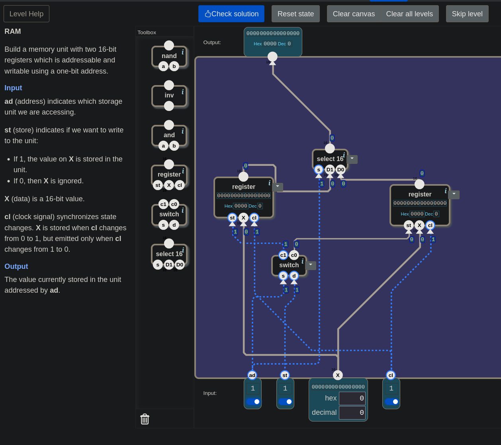
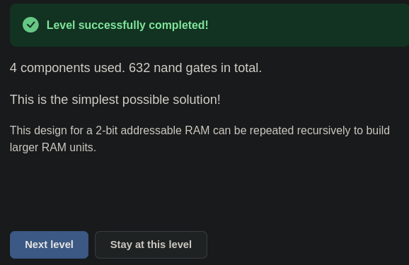

# 🧮 From Switches to a Computer — RAM: Words with Numbers

> In this level one connection was first built backwards: the address and the
> write permission were wired to the legs of `switch` the wrong way round. The
> mistake came out when it was tested with a small example table. There was also
> this question: if the address goes to both registers, won't both of them write?
> Its answer turned out to be the real idea of this level.

---

## 📋 Table of Contents

- [What Does This Part Do?](#what-does-this-part-do)
- [Address](#address)
- [Which Wire Is Not Shared?](#which-wire-is-not-shared)
- [A Register Doesn't Know Its Address](#a-register-doesnt-know-its-address)
- [Distribute When Writing](#distribute-when-writing)
- [Gather When Reading](#gather-when-reading)
- [🎮 Now You Build It](#-now-you-build-it)
- [Bigger RAM](#bigger-ram)
- [Memory Is Done](#memory-is-done)

---

## What Does This Part Do?

You are at the sixth and last door of the Memory unit. The landscape:

```
inputs:    ad (1 bit) · st (1 bit) · X (16 bits) · cl (1 bit)
output:    16 bits
toolbox:   nand · inv · and · register · switch · select 16
```

The level's definition: *"Build a memory unit with two 16-bit registers which is
addressable and writable using a one-bit address."*

| input | what |
|---|---|
| `ad` | **address:** which storage unit we are accessing |
| `st` | should it be written: if 1, `X` is stored in the unit; if 0, `X` is ignored |
| `X` | 16-bit data |
| `cl` | the bell: `X` is stored as `cl` goes from 0 to 1, and emitted as it goes from 1 to 0 |

**Output:** the value currently stored in the unit addressed by `ad`.

---

## Address

The window that opens explains the level's idea:

> *"You can now store a 16-bit word in a register. We can get more memory just by
> stacking these registers. But since a processor operates on a word at a time,
> we need a way to select and change individual words in a larger bank of memory.
> We use memory addresses for this. We assign each word in memory a number so we
> can fetch or overwrite a word by using this number."*

This idea is not new. In [14](./14_alu.md#floor-and-flat-control-bits-are-an-address)
one section was called "Floor and Flat: Control Bits Are an Address". There, the
control bits selected an **operation** inside the ALU. Here, the address bit
selects a **word.**

Since the address is a single bit, there are two words: register number 0 and
register number 1.

---

## Which Wire Is Not Shared?

In [19](./19_register.md#shared-or-separate) the rule was "control wires shared,
data wires separate". Here things change. The first question was: which of the
wires `X`, `cl` and `st` must **not** go to both registers at once?

The answer: **`st`.** If it went to both registers, both would be written when
`st = 1`. `st` has to be **routed** to the right register.

`X` and `cl`, on the other hand, can go to both. It is fine for `X` to reach the
doors of both registers: only the register whose `st` is 1 takes it, the other
one doesn't hear it.

---

## A Register Doesn't Know Its Address

A worry came up here: *"If `ad` selects the register, it shouldn't be shared.
Won't both registers see the same address and write together?"*

The worry is reasonable, but the answer is: **`ad` does not go into the registers
at all.** Look at the register's legs: `st`, `X`, `cl`. There is no address leg. A
register does not know its own number.

Two parts outside read the address and decide based on it:

- **When writing:** the part that takes `st` to the right register.
- **When reading:** the part that picks one of the two registers' outputs and
  gives it to Output.

With the floor-and-flat picture: the flats don't need to know their own number.
It is the sorter at the building's entrance who looks at the number and drops the
letter at the right flat.

---

## Distribute When Writing

The part that sends one input to one of two outputs: **`switch`.** The rule from
[11](./11_selector_switch.md#switch-the-mirror-image):

```
 s = 0   →   d goes to c0   (c1 = 0)
 s = 1   →   d goes to c1   (c0 = 0)
```

The two legs of `switch` have two different jobs:

| leg | its job |
|---|---|
| `s` | **direction:** which output should the sent thing go to? |
| `d` | **what is sent:** the wire being routed |

Here the first answer came out backwards: *"`ad` goes into `d`, that's what is
sent; `st` goes into `s`, for the routing."* An example table showed which one is
right.

The situation: **we want to write to register 0**, so `ad = 0`, `st = 1`.
Expected: `c0 = 1` (register 0 writes), `c1 = 0`.

| connection | what happens | result |
|---|---|---|
| `s ← st`, `d ← ad` | `s = 1` → `d` goes to `c1`; `d = ad = 0` → `c1 = 0`, `c0 = 0` | no register writes ✗ |
| `s ← ad`, `d ← st` | `s = 0` → `d` goes to `c0`; `d = st = 1` → `c0 = 1`, `c1 = 0` | register 0 writes ✓ |

The source of the confusion was the word "sent". What is sent is **what reaches
the register.** And what has to reach the register's `st` leg is the write
permission. The address never reaches the register: it points the way, and then
its job is done.

```
switch:   s ← ad    d ← st    c0 → register 0's st    c1 → register 1's st
```

---

## Gather When Reading

The part that picks one of the two registers' outputs and gives it to Output:
**`select 16`.** Its legs are the mirror of `switch`:

```
select 16:   s ← ad    D1 ← register 1's output    D0 ← register 0's output    →  Output
```

Look at the circuit's symmetry. The same `ad` wire goes to two places:

```
when writing:   switch     →  DISTRIBUTES st      (one → two)
when reading:   select 16  →  GATHERS the output  (two → one)
```

Also note that reading does not depend on the bell. `select 16` is not a memory
part, it is a selector. The moment `ad` changes, the output switches to the other
register's value. The bell only governs **writing.**

---

## 🎮 Now You Build It

Parts list: **2 × `register`**, **1 × `switch`**, **1 × `select 16`**.

1. `switch`: `ad` to `s`, `st` to `d`.
2. Connect `switch`'s `c0` to register 0's `st`, and `c1` to register 1's `st`.
3. Connect `X` to the `X` of both registers.
4. Connect `cl` to the `cl` of both registers.
5. `select 16`: `ad` to `s`, register 0's output to `D0`, register 1's output to
   `D1`. Connect its output to Output.

### How to test the RAM

In each step **only one** switch changes:

| step | change | expected output | what is being tested |
|---|---|---|---|
| 1 | `X = 5` | | `ad = 0` |
| 2 | `st = 1` | | |
| 3 | `cl = 1` | **unchanged** | 5 taken, not shown |
| 4 | `cl = 0` | `5` | 5 written to word 0 |
| 5 | `ad = 1` | undefined (nothing written to register 1 yet) | reading doesn't wait for the bell |
| 6 | `X = 9` | undefined | |
| 7 | `cl = 1` | undefined | 9 taken, not shown |
| 8 | `cl = 0` | `9` | 9 written to word 1 |
| 9 | `st = 0` | `9` | |
| 10 | `ad = 0` | **`5`** | word 0 is intact |
| 11 | `ad = 1` | **`9`** | |
| 12 | `X = 7` | `9` | |
| 13 | `cl = 1` | `9` | |
| 14 | `cl = 0` | **`9`** | `st = 0`: not written |

Look at steps 10 and 11: the two words stand independently of each other, and
whichever one the address points to is the one read.

<details>
<summary>🔑 Stuck? — connection list</summary>

```
switch:        s ← ad    d ← st
register 0:    st ← switch.c0    X ← X    cl ← cl
register 1:    st ← switch.c1    X ← X    cl ← cl
select 16:     s ← ad    D0 ← register 0    D1 ← register 1    →  Output
```

</details>

The game's answer:

> *"4 components used. 632 nand gates in total. This is the simplest possible
> solution!"*


*The circuit that passed. `switch` in the middle, `select 16` at the top, and `ad` goes to both.*


*The game adds one more sentence: this design can be repeated recursively to build larger RAM units.*

---

## Bigger RAM

The game's last sentence: *"This design for a 2-bit addressable RAM can be
repeated recursively to build larger RAM units."*

"Recursively" means this: the two-word RAM you just built is now a part too. Put
two of them side by side, a new `switch` in front and a new `select 16` behind,
connect those to a new address bit, and you get a four-word RAM. Two of those
make eight words, and so on.

Each new address bit doubles the number of words. The rule from
[04](./04_teller_sayi_olunca.md#how-many-wires-how-many-numbers) holds here too:
`n` wires can carry `2ⁿ` different numbers, and `n` address bits can give numbers
to `2ⁿ` words.

---

## Memory Is Done

The six doors of the Memory unit are a single path:

| lesson | what was built |
|---|---|
| [16](./16_sr_latch.md) | two NANDs holding each other: the bit lives in the loop |
| [17](./17_d_latch.md) | a translator in front: the forbidden row becomes unreachable in the stable state |
| [18](./18_data_flip_flop.md) | taking and showing separated: the clock |
| [19](./19_register.md) | bits side by side: the memory of a number |
| [20](./20_counter.md) | one step per bell: `PC ← PC + 1` |
| 21 | words with numbers: the address |

From a single gate to a memory that is read and written by address.

### Next up

**The Processor unit.**

---

## Summary — Keep in Mind

```
☐ RAM: a memory of words selected by address. Each word gets a number (its address).
☐ The address idea is "floor and flat" from 14: there it selects an operation, here a word.
☐ A one-bit address → two words (register 0 and register 1).
☐ ⚠️ st does not go to both registers: both would be written. st is ROUTED.
☐ X and cl can go to both: only the register whose st is 1 takes X.
☐ 🔑 A register doesn't know its address: its legs are st, X, cl. The address is read outside, by switch and select.
☐ DISTRIBUTE when writing: switch, s ← ad (direction), d ← st (what is sent). c0 → register 0, c1 → register 1.
☐ ⚠️ "What is sent" = what REACHES the register = the write permission. The address only points the way.
☐ The backwards connection (s ← st, d ← ad): with ad = 0, st = 1, no register writes.
☐ GATHER when reading: select 16, s ← ad, D0 ← register 0, D1 ← register 1.
☐ The same ad wire goes two ways: switch distributes, select gathers.
☐ Reading doesn't wait for the bell: select is a selector, the output changes as soon as ad changes. The bell only governs writing.
☐ Solution: 4 components, 632 nands, the simplest.
☐ Recursive growth: each new address bit doubles the number of words. n address bits → 2ⁿ words.
```

---

## 🔗 Related Topics

- [20_counter.md](./20_counter.md) — The previous door of Memory; the register that holds the number
- [19_register.md](./19_register.md) — Each word of the RAM; control wires shared, data wires separate
- [14_alu.md](./14_alu.md) — "Floor and Flat: Control Bits Are an Address"
- [11_selector_switch.md](./11_selector_switch.md) — The selector gathers, the switch distributes
- [04_teller_sayi_olunca.md](./04_teller_sayi_olunca.md) — `n` wires, `2ⁿ` numbers

---

**Previous topic:** [20_counter.md](./20_counter.md)
**Next topic:** *(on the way — the Processor unit)*

*This lesson is part of the "From Switches to a Computer" series. The series moves along together with [nandgame.com](https://nandgame.com).*
