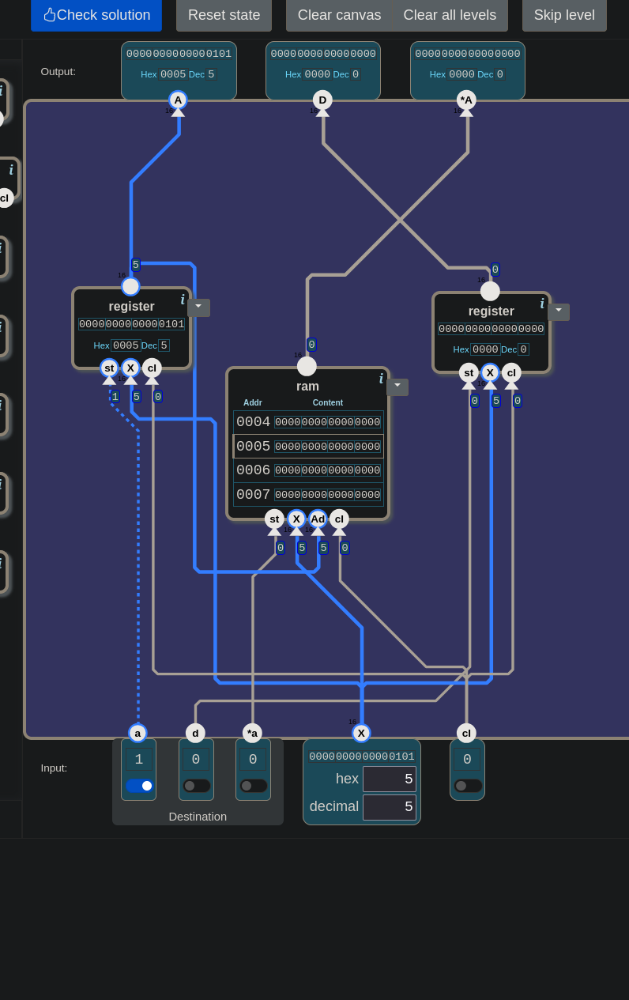
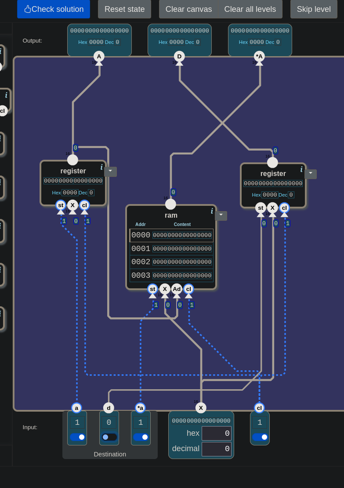
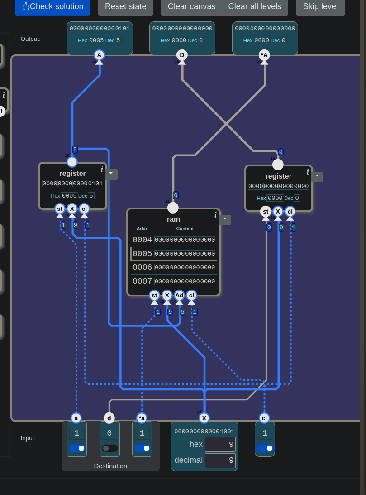
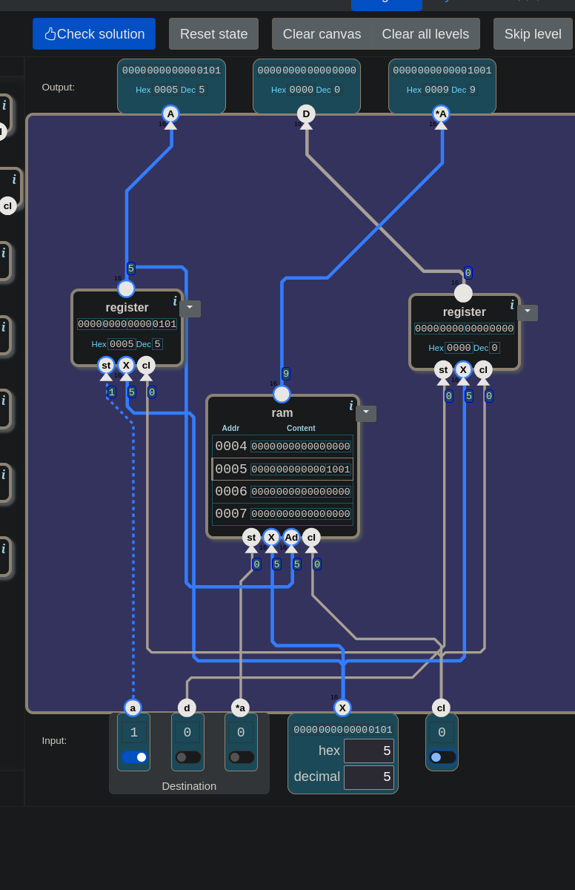

# 🧮 From Switches to a Computer — Combined Memory: The Two Jobs of A

> In this level two questions came first: where does `st` come from, and what
> exactly does the level want? The circuit was built, but one wire was forgotten;
> the game wrote 0 into A instead of 7. Then came an experiment: if, on the same
> bell, you write both to A and to the address A points at, which address does
> RAM write to, the old one or the new one? Seeing the answer meant looking
> inside RAM. And there was only one way to look inside RAM.

---

## 📋 Table of Contents

- [What Does This Part Do?](#what-does-this-part-do)
- [Where Does `st` Come From?](#where-does-st-come-from)
- [Which Address?](#which-address)
- [Lowercase, Uppercase](#lowercase-uppercase)
- [🎮 Now You Build It](#-now-you-build-it)
- [When a Wire Is Left Loose](#when-a-wire-is-left-loose)
- [To A and RAM on the Same Bell](#to-a-and-ram-on-the-same-bell)
- [How Do You Look Into RAM?](#how-do-you-look-into-ram)
- [A Is Both Data and Address](#a-is-both-data-and-address)
- [The Processor Has Begun](#the-processor-has-begun)

---

## What Does This Part Do?

You are at the first door of the Processor unit. The landscape:

```
inputs:    a · d · *a (1 bit each) · X (16 bits) · cl (1 bit)
outputs:   A · D · *A (16 bits each)
toolbox:   register · ram · nand · inv · and · or · xor
```

The window that opens:

> *"A processor uses both kinds of memory, registers, and RAM. Registers are
> directly accessible by the processor and used for intermediate values and
> calculations. RAM can store a large amount of data, but we can read or write
> from only a single address at a time. In this processor we have two registers
> called A and D and one RAM bank. In this mission, combine the two registers
> with the RAM bank."*

The inputs:

| input | what |
|---|---|
| `a` | if 1, `X` is written to the A register |
| `d` | if 1, `X` is written to the D register |
| `*a` | if 1, `X` is written to RAM, **at the address given by the A register** |
| `X` | the 16-bit number to write |
| `cl` | the bell |

The definition says two more things: the flags can be combined, and then `X` is
written to several places at once. If all three are 0, `X` is ignored.

The outputs:

| output | what |
|---|---|
| `A` | the value currently stored in the A register |
| `D` | the value currently stored in the D register |
| `*A` | the value currently stored in RAM, at the address given by the A register |

In one sentence: *give me a number and a destination, I'll write it there when
the bell rings; and at every moment I'll show A, D, and the RAM cell A points at.*

The `ram` in the toolbox has the same legs as the RAM you built in
[21](./21_ram.md): `st`, `X`, `Ad`, `cl`. The difference is in the address wire:
there `ad` was one bit, here `Ad` is 16 bits. By the rule in
[21](./21_ram.md#bigger-ram), `n` address bits can number `2ⁿ` words: 16 bits,
65536 words.

---

## Where Does `st` Come From?

That was the first question when the level opened.

First, recall `st` itself. From [19](./19_register.md): `st` is the register's
own leg. It means "should it be written?": with `st = 1` the bell takes `X` in,
with `st = 0` the register keeps its old value.

A leg does nothing on its own; a wire has to feed it. Which wire? Start from the
need: we want to write `X` to one of three destinations, or to several of them.
Each destination has its own `st`. So for every `st` we need a wire that answers
"should this destination write?"

Look at the input table again: "`a`: if 1, `X` is written to the A register."
That sentence is just another way of saying "the `a` wire goes to A's `st`."

```
a    ──►  the A register's st
d    ──►  the D register's st
*a   ──►  ram's st
X    ──►  the X of all three
cl   ──►  the cl of all three
```

> 🔑 **A flag is an `st` wire.** "`a`: write X to A" and "`a` → A's `st`" are
> the same sentence.

Notice the difference from 21. In [21](./21_ram.md#distribute-when-writing)
there was a single `st`, and it had to be **routed** to one of two registers
according to the address; `switch` did that. Here every destination has its own
flag. Whoever sets the flags decides which destination writes. Nothing is left
to route, so there is no `switch` either.

`X` and `cl`, on the other hand, go to all three. The rule is the same as in 21:
it's fine for `X` to reach the door, only the one whose `st` is 1 takes it.

---

## Which Address?

RAM has one more leg: `Ad`, meaning "which cell?" The answer is hidden in the
output table: `*A` = "the value in RAM **at the address given by the A
register**." If RAM is always to look at the cell A points at, `Ad` gets the
A register's output.

The A register's output now goes to **two places**: the `A` output at the top,
and RAM's `Ad`. Pulling more than one wire from an output is allowed.

RAM's own output goes to `*A`. So RAM has two wires that have to do with A, but
their jobs are different:

```
Ad       ←  the A register's output     "which cell should I look at?"
output   →  *A                          "what is in that cell?"
```

---

## Lowercase, Uppercase

The same letter shows up in four places in this level:

| written | what | direction |
|---|---|---|
| `a` | permission to write to A | input |
| `A` | what is in the A register | output |
| `*a` | permission to write to RAM, at the address A points at | input |
| `*A` | what is in RAM, at the address A points at | output |

> ⚠️ **Lowercase is a write permission, uppercase is a value being read.** `*a`
> goes to RAM's `st`, `*A` comes from RAM's output. Read the `*` as "the place A
> points at."

---

## 🎮 Now You Build It

Parts list: **2 × `register`**, **1 × `ram`**. No gates needed.

One register will be A, the other D. When you're done, every input leg should
have a wire: 3 on each register, 4 on `ram`, **10** in total. And one wire to
each of the three outputs at the top.

### How to test it

Start with **Reset state**: the registers and RAM are cleared to 0. In each row,
make the settings first, then ring the bell (`cl` 1, then 0).

| step | settings | `A` | `D` | `*A` | what is being tested |
|---|---|---|---|---|---|
| 1 | `X = 5`, `a = 1` | 5 | 0 | 0 | written to A. `*A` now shows RAM[5]: empty |
| 2 | `X = 7`, `a = 0`, `*a = 1` | 5 | 0 | **7** | written to RAM[5], A unchanged |
| 3 | `X = 3`, `*a = 0`, `d = 1` | 5 | **3** | 7 | written to D |
| 4 | `X = 9`, `d = 0`, `a = 1` | 9 | 3 | **0** | A moved to 9. `*A` now shows RAM[9]: empty |
| 5 | `X = 5` | 5 | 3 | **7** | A back at 5. The 7 in RAM[5] is still there |
| 6 | `X = 1`, `a = 0` | 5 | 3 | 7 | all three flags 0: `X` ignored |

Look at steps 4 and 5: the value `*A` shows changes with wherever A points.

<details>
<summary>🔑 Stuck? — connection list</summary>

```
A register:   st ← a     X ← X    cl ← cl                       →  A,  ram's Ad
D register:   st ← d     X ← X    cl ← cl                       →  D
ram:          st ← *a    X ← X    cl ← cl    Ad ← A register    →  *A
```

</details>

The game's answer:

> *"3 components used. 416 nand gates in total. And 161792 for each kilobyte of
> RAM. This is the simplest possible solution!"*

416 is the share of the two registers: 2 registers × 16 bits × 13 nands. In
[19](./19_register.md) a one-bit flip-flop counted as 13 nands. RAM is counted
separately: 161792 per kilobyte.


*The passing circuit. The register on the left is A, the one on the right is D. The `ram` in the middle gets A's output on its `Ad`.*


*Level passed.*

---

## When a Wire Is Left Loose

On the first attempt the game gave this report:

> *"1. Set a=1 and X=7. Should store the number 7 in register A
> 2. Set cl=1 - clock tick.
> 3. Set cl=0 - clock cycle complete. The stored number should now be emitted on A.
> Expected output A to be 7 but was 0"*

0 can mean two things: A never wrote (`st` or `cl` loose), or it wrote, but wrote
0 (`X` loose). The report doesn't tell them apart. The way to tell them apart is
to trace the A register's legs one by one:

| leg | state |
|---|---|
| `st` | comes from `a` ✓ |
| `cl` | comes from `cl` ✓ |
| output | goes to `A` and to RAM's `Ad` ✓ |
| `X` | **no wire** ✗ |


*The first attempt. The wire from the `X` input at the bottom goes to RAM and to the register on the right, not to the one on the left.*

> 🎮 **The game makes it easier here:** an unconnected input counts as 0. That's
> why the mistake stayed silent: the circuit didn't behave as if something were
> broken, the expected number just didn't arrive. **In reality:** a floating
> input is not 0, its value is undefined. In
> [08](./08_increment.md#-now-you-build-it) the `B` leg of `add 16` was left
> floating on purpose, and a note was made there too: in a real circuit a
> floating input can even fall into the forbidden band from
> [01.5](./01.5_yasak_bolge.md), the grey band between 0 and 1 that counts as
> neither.

> 💡 Before pressing Check solution, count the input legs. This circuit has 10;
> if you don't count 10 wires, one is loose.

---

## To A and RAM on the Same Bell

The definition says "the flags can be combined." So what happens if `a` and `*a`
are on together? `X` will be written to A, and also to RAM, **at the address A
points at.** But A itself changes on that bell. Which address does RAM write to:
A's old value or its new one?

It was tried with the level open. The values were chosen to be different on
purpose: old address 5, new value 9.

| step | settings | bell | `A` | `Ad` | observation |
|---|---|---|---|---|---|
| 1 | Reset state; `X = 5`, `a = 1` | `cl` 1, then 0 | 5 | 5 | RAM[5] = 0 |
| 2 | `X = 9`, `*a = 1` | `cl = 1` | **5** | **5** | A's output is still 5 |
| 3 | | `cl = 0` | 9 | 9 | RAM[9] = **0**: not written at the new address |
| 4 | `*a = 0`, `X = 5` | `cl` 1, then 0 | 5 | 5 | `*A` = **9**: RAM[5] = 9 |


*Step 2, `cl = 1`. Both the A register's output and RAM's `Ad` are still 5.*


*Step 4. A is back at 5 and `*A` shows 9: the 9 was written at the old address.*

**RAM wrote at the old address.**

The reason is the rule from [18](./18_data_flip_flop.md): a register's output
changes only at the moment `cl` falls from 1 to 0. Throughout `cl = 1`, A's
output stays at its old value, 5. During that time RAM reads where to write from
`Ad`, that is, from A's old value. It's the same situation as the loop in
[20](./20_counter.md#the-loop-now-turns-once): there `inc 16` looked at the
register's old value throughout the bell, here RAM looks at A's old value.

This isn't a game convenience; you could find it without opening the game. In the
RAM you built in [21](./21_ram.md), each word was a register whose `st` came from
`switch`. And in [18](./18_data_flip_flop.md#receiver-and-showcase) the receiver
gate of every flip-flop inside a register, the gate of the half that takes the
newly arriving value, was `and(st, cl)`. Follow the gate of word 9:

```
throughout cl = 1:   Ad = 5   →   word 9's st is 0   →   and(0, 1) = 0   gate closed
as cl falls:         Ad = 9   →   word 9's st is 1   →   and(1, 0) = 0   gate still closed
```

There is no moment when word 9's gate can open. The game's `ram` box gave the same
result.

> 🔑 **During the bell, everyone looks at the old values.** A register's new value
> only shows once the bell falls. If you write to both A and `*A` on the same
> bell, RAM writes at the address A pointed at **before.**

> 💡 If you try this experiment yourself, choose different values. If you use the
> same number as both address and data (`X = 5` while A = 5), you can't tell where
> the 5 you see in RAM came from. And don't press Reset state in the middle of
> the experiment: it also wipes the address in A.

---

## How Do You Look Into RAM?

The last step of the experiment needed a look at RAM[5]. In the game the `ram`
box has a four-row table on it, but it doesn't scroll by hand: it always shows
the area around the address on `Ad`. While A was at 9 the table showed
0008–000b; 0005 wasn't visible.

The only way was to take A back to 5, this time without writing to RAM
(`*a = 0`). Once A was 5, the table went back to 0005, and the `*A` output
showed RAM[5].

The table is the game's interface, but what it reflects is the circuit's rule: the
only place RAM is read from is `*A`, and `*A` only gives the cell A points at.

> 🔑 **The only way to look at a cell in RAM is to take A to that address.**

---

## A Is Both Data and Address

One more question had been asked: *"What will the other register do?"*

In this level D only stores: `X` → D, D → the `D` output. It isn't connected to
anything else.

A, though, has two jobs: it stores a number (the `A` output) **and** it points
RAM at an address (`Ad`).

Why is there a second register? The experiment just answered it. When you moved A
from 5 to 9, the 5 in A was gone. To look at another cell in RAM you have to take
A there, and the number sitting in A is lost at that moment. While A is busy
pointing at an address, there needs to be a place to hold another number: D.

```
A  →  both data and address    moved around to look into RAM
D  →  data only                holds the number while A moves
```

---

## The Processor Has Begun

The unit's first door is open: A, D and RAM in a single memory box.

At the end of [21.5](./21.5_sayi_mi_komut_mu.md#entering-the-processor) three
questions were left open. A first look at the third one in this level: `cl`
still comes from outside, a switch in the Input row.

And note this: `a`, `d`, `*a` are switched by hand for now. With the idea from
21.5: if the bits of a number were connected to these wires, that number would
make the "where should `X` be written" decision.

---

## Summary — Keep in Mind

```
☐ Combined Memory: two registers (A, D) and a RAM in one box. One X, three possible destinations.
☐ 🔑 A flag = an st wire: a → A's st, d → D's st, *a → ram's st.
☐ X and cl go to all three. Only the one whose st is 1 takes X.
☐ Difference from 21: there a single st was routed by address (switch). Here every destination has its own flag, no switch.
☐ Flags can be combined. If all three are 0, X is ignored.
☐ RAM's Ad ← the A register's output. RAM's output → *A.
☐ A's output goes to two places: the A output and RAM's Ad.
☐ ⚠️ Lowercase is a write permission (a, *a), uppercase is a value being read (A, *A). * = "the place A points at".
☐ A loose input counts as 0 in the game, so the mistake stays silent. In reality a floating input is undefined.
☐ Before Check solution, count the input legs: register 3, ram 4, 10 in this circuit.
☐ 🔑 During the bell, everyone looks at the old values. With a and *a both on, RAM writes at the address A pointed at BEFORE.
☐ Not a game convenience: word 9's receiver gate is and(st, cl). As cl falls, even if the address moves to 9, and(1, 0) = 0.
☐ In the experiment choose different values (5 and 9). Don't press Reset state in the middle.
☐ 🔑 The only way to look at a cell in RAM is to take A to that address. The table is the game's interface; its following Ad reflects the circuit's rule.
☐ A is both data and address, D is data only. D holds the number while A moves.
☐ Solution: 3 components, 416 nands (2 × 16 × 13) + 161792 per kilobyte, the simplest.
☐ cl still comes from outside in this level.
```

---

## 🔗 Related Topics

- [21.5_sayi_mi_komut_mu.md](./21.5_sayi_mi_komut_mu.md) — Where control wires come from; three questions for entering the Processor
- [21_ram.md](./21_ram.md) — The address; a register doesn't know its address; routing `st` with `switch`
- [19_register.md](./19_register.md) — `st`: should it be written?
- [18_data_flip_flop.md](./18_data_flip_flop.md) — The output only changes as `cl` falls
- [20_counter.md](./20_counter.md) — Looking at the old value during the bell: the loop turns once
- [08_increment.md](./08_increment.md) — A floating input: 0 in the game, undefined in reality

---

**Previous topic:** [21.5_sayi_mi_komut_mu.md](./21.5_sayi_mi_komut_mu.md)
**Next topic:** *(on the way — the second level of the Processor unit)*

*This lesson is part of the "From Switches to a Computer" series. The series moves along together with [nandgame.com](https://nandgame.com).*
