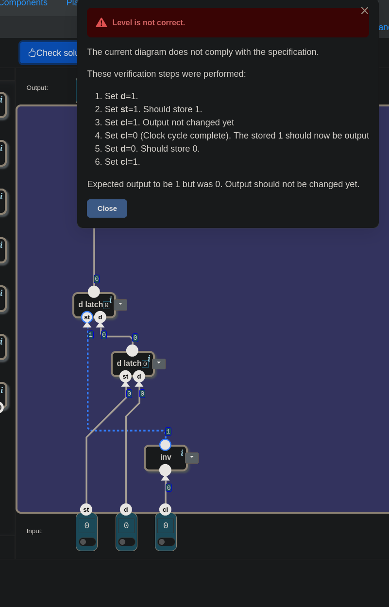
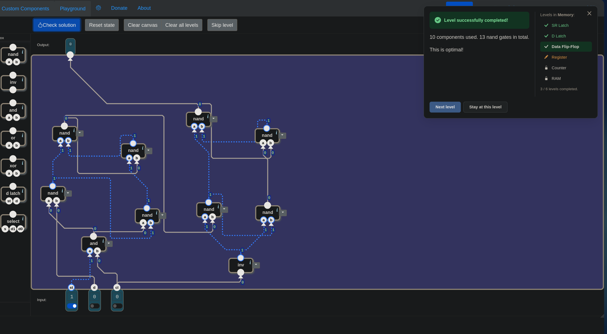

# 🧮 Şalterden Bilgisayara — Data Flip-Flop: Alıcı ile Vitrin

> Bu seviyede ilk deneme düştü. Devrenin iki parçası da doğru yerdeydi, eksik olan
> tek bir kapıydı. O kapının neden şart olduğu, oyunun hata mesajı satır satır
> okununca ortaya çıktı. Sonra aynı devre daha az nand'la yeniden kuruldu ve
> kablolar arasında iki kez kaybolundu.

---

## 📋 İçindekiler

- [Bu Parça Ne Yapıyor?](#bu-parça-ne-yapıyor)
- [Nerede Kalmıştık?](#nerede-kalmıştık)
- [Saat: Herkes Aynı Zile Bakar](#saat-herkes-aynı-zile-bakar)
- [D Latch Neyi Yapamıyor?](#d-latch-neyi-yapamıyor)
- [Aynı Anda Kaç Bit?](#aynı-anda-kaç-bit)
- [Alıcı ile Vitrin](#alıcı-ile-vitrin)
- [Kapılar Ne Zaman Açık?](#kapılar-ne-zaman-açık)
- [Birinci Deneme Düştü](#birinci-deneme-düştü)
- [Cam Geri Geldi](#cam-geri-geldi)
- [and ile inv Birbirinin Tersi mi?](#and-ile-inv-birbirinin-tersi-mi)
- [🎮 Şimdi Sen Kur](#-şimdi-sen-kur)
- [Kutular Açılınca](#kutular-açılınca)
- [Açılışta Yine Tanımsız](#açılışta-yine-tanımsız)

---

## Bu Parça Ne Yapıyor?

Memory bölümünün üçüncü kapısındasın. Manzara şu:

```
girişler:   st · d · cl   (1'er bit)
çıkış:      1 bit
kutu:       nand · inv · and · or · xor · d latch · select
```

Kutuda yine yeni bir parça var: **`d latch`.** Bir önceki derste kurduğun devre
kapatılmış, tek parça olarak duruyor. Bir de yeni bir giriş var: **`cl`.**

Seviye bu sefer bir tablo değil, bir **sıra** anlatıyor:

| an | ne olur |
|---|---|
| `cl = 0` | `st` ile `d` değişebilir |
| `cl` 1'e çıkarken | `st = 1` ise `d`'nin o anki değeri **saklanır.** Çıkış henüz **değişmez.** |
| `cl` 0'a inerken | saklanan değer **çıkışa verilir** |

`cl` 1'e çıkarken girişlerin etkisi:

| st | d | etki |
|---|---|---|
| 1 | 0 | sonraki = 0 |
| 1 | 1 | sonraki = 1 |
| 0 | 0 | değişmez |
| 0 | 1 | değişmez |

Altında iki not var: *"İlk saklamadan ve ilk saat devrinden önce çıkış
tanımsızdır"* ve *"`cl = 1` iken girişlerin değişmeyeceğini varsay."*

---

## Nerede Kalmıştık?

[17](./17_d_latch.md#kapı-açıkken)'nin sonunda bir sorun bırakılmıştı. D Latch
**şeffaf**: `st = 1` olduğu sürece çıkış `d`'yi anında izliyor. PC'yi D
Latch'lerde tutup `PC ← PC + 1` yapmaya kalkınca, kapı açık kaldığı sürece sayı
durmadan artıyordu. İstenen şey tek bir adımdı.

Oradaki cümle şuydu: bilgisayarın ihtiyacı "kapı açık olduğu sürece" değil,
**"tam şu anda, bir kez."**

Seviyeyi açınca çıkan pencere de aynı yerden başlıyor:

> *"Latch'lerle zamanla durumu değişen bir devre kurabilirsin. Ama o zaman bir
> sorun çıkar: durum değişiklikleri devre boyunca eşzamanlı olmadığı için,
> değişiklikler devrede öngörülemeyen bir sırayla yayılır; bu da **yarış
> koşullarına** ve genel olarak öngörülemeyen sonuçlara yol açar."*

Bu yarışları gördün. [16](./16_sr_latch.md#kullanılmayan-satır)'da `0 0`'dan
çıkarken, 17'de bir anlık iğnede ve seçicili latch'te. Pencerenin önerdiği çözüm:
**saat sinyali.**

---

## Saat: Herkes Aynı Zile Bakar

`cl`, *clock*, yani **saat.** Durmadan 0, 1, 0, 1 diye gidip gelen bir tel. Oyunda
onu elle çeviriyorsun. Her gidip gelme bir **saat devri.**

Bu seviyede iki giriş iki ayrı sorunun cevabı:

| giriş | sorduğu soru |
|---|---|
| `st` | **Yazılsın mı?** D Latch'teki izinle aynı. |
| `cl` | **Ne zaman?** Değişiklikler yalnızca onun ritmiyle olur. |

Fikir basit: bütün hafıza parçaları aynı zile bakarsa, değişiklik yalnızca zil
anında olur. Aradaki zamanda teller yine yarışabilir, ama o yarışın sonucunu
kimse görmez. Çıkışlar kıpırdamaz.

Yarışı izleyen ya da kimin önce geleceğine tek tek karar veren biri yok.
Yarış yine yaşanıyor, sadece **görünmüyor.**

---

## D Latch Neyi Yapamıyor?

Tabloya bakınca sorulan ilk soru bu: *bu seviye, D Latch'in yapamadığı neyi
istiyor?*

D Latch'in ne yaptığı önce doğru özetlendi: içinde bir SR Latch var, önüne bir
çevirmen konmuş, `st = 1` iken `d`'nin o anki değerini SR Latch'in diline çevirip
yazıyor. Ama bir şey atlandı, sorunun cevabı da tam orada:

> 🔑 D Latch yazdığı anda **çıkışa da veriyor.**

Bundan sonra iki kelime sık geçecek:

- **Almak:** `d`'nin değerini içeride saklamak. Değer artık devrenin içinde, ama
  dışarıdan görünmüyor.
- **Göstermek:** saklanan değeri çıkış teline vermek. Çıkışa bağlı başka bir devre
  varsa, değeri ancak o zaman görüyor.

D Latch'te bu ikisi aynı olay: yazdığı anda değer çıkışta da görünüyor. Burada ise
iki ayrı an var:

| an | D Latch | Data Flip-Flop |
|---|---|---|
| alma | `st = 1` iken | `cl` 1'e çıkarken |
| gösterme | **alırken, aynı anda** | `cl` 0'a inerken, **sonra** |

Almak ile göstermek ayrılmış.

---

## Aynı Anda Kaç Bit?

Somut bir örnekle düşün:

1. Çıkış şu an **0**. Daha önce saklanmış bir değer.
2. `d = 1`, `st = 1` yapıldı. `cl` 1'e çıktı. Tabloya göre 1 **alındı.**
3. Ama çıkış henüz **değişmemeli.** Hâlâ 0 göstermeli.

### Çıkış neden beklemeli?

Çünkü çıkışa bakan başka devreler var, ve çoğu zaman onların hesabı bu değerin
kendisine dayanıyor. [17](./17_d_latch.md#kapı-açıkken)'deki örneği hatırla:
`PC ← PC + 1`. Artırma devresi PC'nin çıkışını okuyor, sonucunu PC'nin `d`'sine
geri veriyor. Çıkış, yeni değer alındığı anda değişseydi, artırma devresi yeni
değeri hemen görür, bir daha artırır, o da hemen alınır. 17'deki durmadan artan
sayaç geri gelirdi.

Flip-flop bunu iki adıma bölüyor. Önce çıkışa **verilecek değer seçilip** içeride
bekletiliyor. Bu sırada çıkış eski değeri göstermeye devam ediyor, ona bakan
devreler de eski değerle işini bitiriyor. Zil çalınca yeni değer tek seferde
çıkışa veriliyor. Yarış yine yaşanıyor, ama sonucu kimseye ulaşmıyor.

### Bunun bedeli

O an devre iki şeyi birden hatırlamak zorunda: **yeni alınan 1'i** ve **çıkışta
gösterdiği eski 0'ı.**

Bir D Latch aynı anda iki bit tutabilir mi? Tutamaz. Ama cevap da hemen oradan
çıktı:

> *"Bir D Latch bir veri tutuyorsa, iki D Latch iki tane tutar."*

---

## Alıcı ile Vitrin

İki latch'e rollerine göre ad verelim:

- **Alıcı:** yeni gelen değeri alan.
- **Vitrin:** çıkışta gösteren.

Kurarken sorulan soru şu oldu: *bu iki latch birbirinin neyi tuttuğunu bilmek
zorunda mı?*

Zorunda değil. Konuşma iki yönlü değil, **tek yönlü bir el değiştirme.** `cl`
0'a inince alıcıdaki değerin vitrine geçmesi gerekiyor. Vitrin alıcının içine
bakmıyor, **alıcı ona bir tel uzatıyor.**

Üç tel buradan çıkıyor:

```
dışarıdaki d        →  alıcının d'si
alıcının çıkışı     →  vitrinin d'si
vitrinin çıkışı     →  Output
```

Kitaplarda bu yapının adı *master–slave flip-flop*: alıcı *master*, vitrin
*slave*.

---

## Kapılar Ne Zaman Açık?

Geriye iki latch'in `st` bacakları kalıyor: hangi kapı ne zaman açık?

**Vitrin.** Tablo "`cl` 0'a inince göster" diyor. Yani vitrinin kapısı `cl = 0`
iken açık olmalı. Ama D Latch'in kapısı `st = 1` iken açılıyor. `cl` 0 iken 1,
`cl` 1 iken 0 olan bir tel lazım:

```
vitrinin st'si  ←  inv(cl)
```

**Alıcı.** Alıcının iki şartı var ve ikisi aynı anda sağlanmalı: `st = 1`
(yazma izni) **ve** `cl = 1` (saat 1'de). İki şart aynı anda 1 olunca 1 veren kapı:

```
alıcının st'si  ←  and(st, cl)
```

Ama bu ikinci parça ilk denemede yoktu.

---

## Birinci Deneme Düştü

İlk kurulan devrede vitrin doğruydu: `st`'si `inv(cl)`'de, `d`'si alıcının
çıkışında. Alıcının `st`'sine ise doğrudan dışarıdaki `st` bağlanmıştı. `cl` hiç
işin içinde değildi.


*Birinci deneme. Alttaki latch alıcı, `st`'si doğrudan `st` girişine bağlı. Üstteki vitrin, kapısı `inv(cl)`'den.*

Check solution şu sırayı denedi:

> 1. `d = 1` · 2. `st = 1` · 3. `cl = 1`, çıkış henüz değişmemeli · 4. `cl = 0`,
> saklanan 1 çıkışa verilmeli · 5. `d = 0` · 6. `cl = 1`
>
> *"Expected output to be 1 but was 0. Output should not be changed yet."*

Mesaj satır satır okununca olan şey görüldü:

| adım | durum | bu devrede ne oldu |
|---|---|---|
| 4 | `cl = 0`, çıkış 1 | ✓ |
| 5 | `cl` hâlâ 0 iken `d = 0` | alıcı açık (`st = 1`), vitrin de açık (`inv(0) = 1`): 0 iki kapıdan birden geçip çıkışa ulaştı |
| 6 | `cl = 1` | oyun çıkışın hâlâ 1 olmasını bekliyordu, çünkü yeni değer ancak saat devri tamamlanınca görünmeli. Çıkış 5. adımda zaten 0 olmuştu. |

---

## Cam Geri Geldi

Sorun şu: `cl = 0` iken **iki kapı birden açıktı.** O an `d`'den çıkışa kadar
kesintisiz bir yol oluşuyor, devre yine tek bir D Latch gibi davranıyor. Önüne
konan cam geri gelmiş oluyor.

> 🔑 Flip-flop'un sırrı: **iki kapı kararlı durumda hiçbir zaman aynı anda açık
> olmamalı.** Vitrin `cl = 0` iken açık. O hâlde alıcı `cl = 0` iken kapalı olmak
> zorunda.

Alıcının kapısına `and(st, cl)` konunca devre geçti:

> *"4 components used. 31 nand gates in total. This uses the fewest possible
> components. (But it is possible to solve with a lower total of nand-gates.)"*


*Geçen devre. Alttaki alıcının kapısı artık `and(st, cl)`'den geliyor.*

Artık `cl` iki kapıyı ters yönlerde yönetiyor:

| `cl` | alıcı: `and(st, cl)` | vitrin: `inv(cl)` |
|---|---|---|
| 1 | açık (`st = 1` ise) | kapalı |
| 0 | kapalı | açık |

---

## and ile inv Birbirinin Tersi mi?

Devre geçince bir soru daha soruldu: *`and`'in çıkışı `inv` gibi mi davranıyor?*

Cevap "neredeyse", ve o küçük fark devrenin sırrını taşıyor.

**`st = 1` iken evet.** `and(1, cl)` doğrudan `cl`'nin kendisi, `inv(cl)` da onun
tersi. İki kapının telleri birbirinin tam tersi.

**`st = 0` iken hayır.** `and` her durumda 0 verir, alıcı hep kapalı kalır.
`cl = 1` anında iki kapı birden kapalı olur. Yani iki tel her zaman birbirinin
tersi değil.

Asıl kural "hep ters" değil, ondan daha zayıf ama yeterli olan şu:

> 🔑 **Kararlı durumda ikisi aynı anda asla açık olmaz.** Biri açıksa öbürü
> kesinlikle kapalı. İkisinin birden kapalı olması zararsız: o sırada değer
> yalnızca korunur.

Sonuç: çıkış yalnızca **`cl`'nin 1'den 0'a indiği anda** değişiyor. O tek an
dışında `d` ne yaparsa yapsın çıkış kıpırdamıyor. 17'nin istediği "tam şu anda,
bir kez" bu, ama yalnızca çıkışın **ne zaman** değiştiği için.

> 📌 **Hangi** değerin gösterileceğini ise `cl = 1`'in sonundaki `d` belirliyor.
> Alıcının kapısı `cl = 1` boyunca açık, yani o süre boyunca şeffaf: `d` o sırada
> değişirse alıcı onu izler ve inişteki değer alınır. `st = 1`, `d = 1`, `cl = 1`,
> `d = 0`, `cl = 0` sırasında çıkış 0 oluyor, seviyenin tablosu 1 bekler.
> Seviyenin *"`cl = 1` iken girişlerin değişmeyeceğini varsay"* notu bu yüzden var.

---

## 🎮 Şimdi Sen Kur

Parça listesi: **2 × `d latch`**, **1 × `and`**, **1 × `inv`**.

1. Bir `d latch` koy, bu **alıcı.** `d`'sine dışarıdaki `d`'yi bağla.
2. `and`'in iki ayağına `st` ile `cl`'yi bağla. Çıkışını alıcının `st`'sine ver.
3. İkinci `d latch`'i koy, bu **vitrin.** `d`'sine alıcının çıkışını bağla.
4. `inv`'e `cl`'yi bağla. Çıkışını vitrinin `st`'sine ver.
5. Vitrinin çıkışını `Output`'a bağla.

### Flip-flop'u nasıl test edersin

Her adımda **tek** bir anahtar değişiyor:

| adım | değişen | beklenen çıkış | ne sınanıyor |
|---|---|---|---|
| 1 | `d = 1` | tanımsız | |
| 2 | `st = 1` | tanımsız | |
| 3 | `cl = 1` | **değişmez** | 1 alındı ama gösterilmedi |
| 4 | `cl = 0` | `1` | devir tamamlandı, gösterildi |
| 5 | `d = 0` | **`1`** | `cl = 0` iken `d` duyulmuyor |
| 6 | `cl = 1` | **`1`** | 0 alındı, gösterilmedi (oyunun denetimi birinci denemeyi bu adımda yakaladı; bu tabloyla birinci deneme 5. adımda düşer) |
| 7 | `cl = 0` | `0` | gösterildi |
| 8 | `st = 0` | `0` | |
| 9 | `d = 1` | `0` | |
| 10 | `cl = 1` | **`0`** | çıkış değişmez, vitrin kapalı |
| 11 | `cl = 0` | **`0`** | `st = 0`: bu devirde alınmadı, eski değer tutuluyor |

Adım 5, 6 ve 11'e bak. Flip-flop'un kanıtı bu üç satır.

<details>
<summary>🔑 Takıldıysan — bağlantı listesi</summary>

```
and:              a ← st             b ← cl
inv:              ← cl
d latch (alıcı):  st ← and çıkışı    d ← d
d latch (vitrin): st ← inv çıkışı    d ← alıcının çıkışı
vitrin:           çıkış  →  Output
```

Toplam: 4 bileşen, 31 `nand`.

</details>

---

## Kutular Açılınca

Oyun iki ayrı şey sayıyor: **bileşen** ve **nand.** Dört bileşen, bileşen
sayısında en azı. Ama nand sayısında daha azı mümkün.

31'in nereden geldiğine bak. Birazdan göreceğin çözümde oyun `and` ile `inv`'i
birlikte 5 nand sayıyor. Geriye kalan 26, iki `d latch` kutusunun: kutu başına
13. Oysa 17'de kurduğun D Latch 4 nand'dı ve oyun onun optimal olduğunu söylemişti.

Önce kendin dene. İpucu: **kutuları kullanma.** İki latch'i de kendin nand'lardan
kur. Kutuda `sr latch` yok, o kısmı [16](./16_sr_latch.md)'daki gibi iki nand'ı
çapraz bağlayarak kuracaksın.

Kablolar çoğalınca kaybolmak çok kolay. Bu çözüm kurulurken iki kez kaybolundu.
İşe yarayan şey şu oldu: tuvali **iki sütuna** ayırmak (solda alıcı, sağda
vitrin), her sütunda da **alt sıraya çevirmenleri, üst sıraya SR Latch'i**
koymak.

<details>
<summary>🔑 Cevap — kutusuz devre</summary>

Her sütun 17'deki 4 nand'lık D Latch'in aynısı. Değişen yalnızca kapıya (`en`) ve
veriye (`d`) nereden tel geldiği:

| sütun | kapısı (`en`) | verisi (`d`) |
|---|---|---|
| alıcı | `and(st, cl)` | dışarıdaki `d` |
| vitrin | `inv(cl)` | alıcının çıkışı |

Her sütunun içi aynı dört nand:

| nand | `a` | `b` | görevi |
|---|---|---|---|
| 1 | `en` | `d` | çevirmen |
| 2 | `en` | nand 1'in çıkışı | çevirmen |
| 3 | nand 1'in çıkışı | nand 4'ün çıkışı | SR, **sütunun çıkışı** |
| 4 | nand 2'nin çıkışı | nand 3'ün çıkışı | SR |

Alıcının nand 3'ü vitrinin `d`'sine gider, vitrinin nand 3'ü `Output`'a.

> *"10 components used. 13 nand gates in total. This is optimal!"*


*Kutusuz çözüm. Sağdaki pencerede Memory seviyelerinin listesi de görünüyor.*

</details>

Ortaya çıkan tablo:

| çözüm | bileşen | nand | oyunun dediği |
|---|---|---|---|
| iki `d latch` kutusu | **4** | 31 | en az bileşen |
| kutular açık | 10 | **13** | *"This is optimal!"* |

İkinci çözüm kurması daha zahmetli ama daha küçük. **Kutular insan için, nand'lar
çip için.** Senin açından iki kutuyu bağlamak kolay. Bir çipte ise her nand gerçek
transistör, gerçek alan, gerçek güç. [03.5](./03.5_soyutlama_merdiveni.md)'teki
merdiven burada ters yönde de işliyor: yukarıda çalışmak kolay, bedel en aşağıda
ödeniyor.

> 📌 Bu çözüm denenmeden önce hedef 11 nand sanıldı (`and` 2, `inv` 1 sayılır
> varsayımıyla). Oyun 13 saydı. Oyunun bir kutuyu kaç nand saydığı tahmin
> edilmemeli, ölçülmeli.

Kutuları açmanın bir riski daha var. 17'de seçicili latch kara kutu hâliyle
geçmiş, parçalarına açılınca biti kaybetmişti: kutu içindeki yarışı gizliyordu.
Aynı soru burada da soruldu. Bu devre kapı düzeyinde, her nand'a 1 ile 3 tik
(simülasyonun zaman birimi) arasında farklı gecikmeler verilerek 400 kez simüle
edildi. İlk gösterimden (saklamadan sonraki ilk inişten) sonraki 9 851 adımın
hiçbirinde yanlış ya da kararsız çıkış görülmedi.

Nedeni tek başına az önceki kural değil. Kapı düzeyinde `cl` 1'den 0'a inerken
alıcının kapısı `and(st, cl)` iki nand'dan geçtiği için geç kapanıyor, vitrininki
`inv(cl)` tek nand'dan geçtiği için erken açılıyor: kısa bir an iki kapı
örtüşüyor. O an zararsız, çünkü `d` o sırada sabit (seviyenin notu); çıkışın
geri döndüğü devrelerde (`PC + 1` gibi) ise dönüş yolunun o kısa andan uzun
olması gerekiyor.

---

## Açılışta Yine Tanımsız

Simülasyonda kararsızlık yalnızca bir yerde görüldü: **ilk gösterimden önce**, bazı
açılış durumlarında. İki SR Latch'in her biri [16](./16_sr_latch.md)'daki gibi
iki eşit kararlı durumdan birine, ya da bazı gecikmelerde bir süre titreyerek
uyanıyor. Seviyenin notu da bunu söylüyor: *"ilk saklamadan ve ilk saat devrinden
önce çıkış tanımsız."*

Saat yarışları görünmez kıldı ama açılış anını çözmedi. Bunun adı 16'da konmuştu:
[CWE-1271](../cwe/cwe_1271.md), açılışta değeri belirlenmemiş güvenlik biti. Çözüm
de aynı: güvenlikle ilgili bir bit açılışta, reset sürerken, bilinen bir değere
zorlanmalı.

### Sırada

**Register.**

---

## Özet — Aklında Tut

```
☐ Kutuda artık d latch var: bir önceki dersin devresi kapatıldı. Yeni giriş: cl (saat).
☐ st "yazılsın mı", cl "ne zaman". İkisi ayrı sorular.
☐ Saat fikri: herkes aynı zile bakar, değişiklik yalnızca zil anında olur. Yarış yine olur ama sonucu görünmez.
☐ 🔑 D Latch yazdığı anda çıkışa da verir (şeffaf). Flip-flop almak ile göstermeyi AYIRIR.
☐ Almak = değeri içeride saklamak. Göstermek = saklanan değeri çıkış teline vermek.
☐ cl 1'e çıkarken: st = 1 ise d alınır, çıkış değişmez. cl 0'a inerken: alınan gösterilir.
☐ 🔑 Çıkış neden bekler: ona bakan devreler (PC + 1 gibi) eski değerle işini bitirsin diye. Yeni değer önce seçilir, zil çalınca tek seferde çıkışa verilir.
☐ Alındı ama gösterilmedi anında devre İKİ bit tutar: yeni alınan + eski gösterilen → iki D Latch.
☐ Alıcı ile vitrin birbirini bilmez: tek yönlü el değiştirme. Alıcının çıkışı → vitrinin d'si.
☐ Vitrinin kapısı inv(cl): cl = 0 iken açık.
☐ Alıcının kapısı and(st, cl): iki şart birden, izin VE cl = 1.
☐ ⚠️ Birinci deneme: alıcının kapısında yalnız st vardı. cl = 0 iken iki kapı birden açık → d'den çıkışa kesintisiz yol → devre yine şeffaf. Check 6. adımda düştü.
☐ 🔑 Kararlı durumda iki kapı ASLA aynı anda açık olmamalı. İkisinin birden kapalı olması zararsız.
☐ st = 1 iken and(st, cl) ile inv(cl) birbirinin tersi; st = 0 iken değil. Kural "hep ters" değil, "kararlı durumda asla ikisi birden açık değil".
☐ Sonuç: çıkış yalnızca cl'nin 1'den 0'a indiği ANDA değişir. 17'nin istediği "tam şu anda, bir kez".
☐ 📌 Hangi değerin gösterileceğini cl = 1'in sonundaki d belirler: alıcı cl = 1 boyunca şeffaf. Seviye bu yüzden cl = 1 iken girişleri sabit varsayar.
☐ Hafıza testi bir SIRA: her adımda tek anahtar. Kanıt satırları: cl = 0'da d değişir çıkış değişmez; cl 1'e çıkınca çıkış hâlâ değişmez; st = 0 iken inişte eski değer kalır.
☐ Oyun iki şey sayar: bileşen ve nand. 4 bileşen / 31 nand ≠ 10 bileşen / 13 nand (optimal).
☐ d latch kutusu oyunda 13 nand; 17'deki kendi D Latch'in 4. Kutuları açmak nand'ı düşürür.
☐ 🔑 Kutular insan için, nand'lar çip için. Zahmetli olan çoğu zaman küçük olandır.
☐ ⚠️ Oyunun bir kutuyu kaç nand saydığını tahmin etme, ölç.
☐ Kutular açılınca yarış doğar mı? Simülasyonda doğmadı. Kapı düzeyinde cl inerken iki kapı kısa bir an örtüşür; zararsız, çünkü d o sırada sabit. Çıkışın geri döndüğü devrede dönüş yolu o andan uzun olmalı.
☐ 👾 Açılışta hâlâ tanımsız: saat CWE-1271'i çözmez. Güvenlik biti reset sürerken bilinen değere zorlanmalı.
```

---

## 🔗 İlgili Konular

- [17_d_latch.md](./17_d_latch.md) — Şeffaf latch ve "tam şu anda, bir kez" ihtiyacı; flip-flop'un iki yarısının her biri
- [16_sr_latch.md](./16_sr_latch.md) — Kutusuz çözümde iki kez kurulan çapraz nand çifti
- 👾 **Saatin görünmez kıldığı:** [CWE-1298](../cwe/cwe_1298.md) — aynı telden çıkan iki yolun yarışı
- 👾 **Saatin çözmediği:** [CWE-1271](../cwe/cwe_1271.md) — açılışta değeri belirlenmemiş güvenlik biti
- 👾 **Saatin yakaladığı an:** [CWE-1247 — Voltaj ve saat sıçraması](../cwe/cwe_1247.md) — saat erken gelirse ya da besleme bir an çökerse, yakalanan değer yarım kalır
- [03.5_soyutlama_merdiveni.md](./03.5_soyutlama_merdiveni.md) — Kutular insan için, nand'lar çip için
- [13_arithmetic_unit.md](./13_arithmetic_unit.md) — `PC ← PC + 1`: 17'deki şeffaf latch sorununun çıktığı satır

---

**Önceki konu:** [17_d_latch.md](./17_d_latch.md)
**Sonraki konu:** [19_register.md](./19_register.md)

*Bu ders, "Şalterden Bilgisayara" serisinin bir parçasıdır. Seri, [nandgame.com](https://nandgame.com) eşliğinde ilerler.*
