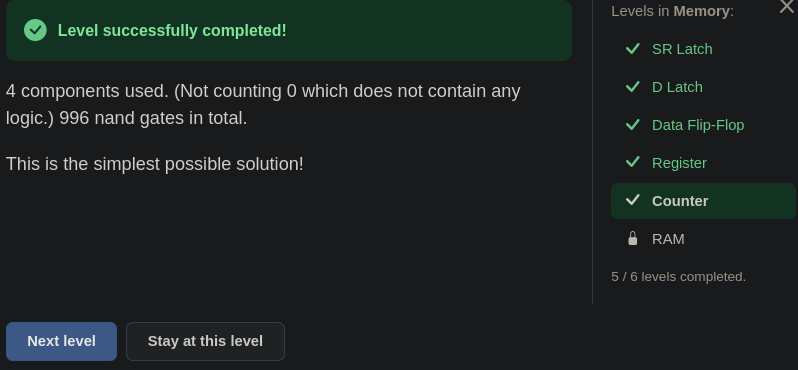

# 🧮 Şalterden Bilgisayara — Counter: Her Zilde Bir Adım

> Bu seviye soru soru çözüldü. Yol boyunca iki yerde durulup geri dönüldü: `inc 16`'nın
> ne yaptığı unutulmuştu, ve `register`'ın yazma bacağına hep `0` bağlamak
> önerildi. İkisi de seviyenin asıl fikrine giden yolu açtı: aynı adı taşıyan iki
> telin aynı işi yapmaması.

---

## 📋 İçindekiler

- [Bu Parça Ne Yapıyor?](#bu-parça-ne-yapıyor)
- [Eski Bir Borç](#eski-bir-borç)
- [Sayıyı Kim Tutuyor?](#sayıyı-kim-tutuyor)
- [Adaylar](#adaylar)
- [Aynı Ad, Farklı Görev](#aynı-ad-farklı-görev)
- [Register Ne Zaman Yazmalı?](#register-ne-zaman-yazmalı)
- [Döngü Artık Bir Kez Döner](#döngü-artık-bir-kez-döner)
- [🎮 Şimdi Sen Kur](#-şimdi-sen-kur)
- [Başka Çözüm Var mı?](#başka-çözüm-var-mı)

---

## Bu Parça Ne Yapıyor?

Memory bölümünün beşinci kapısındasın. Manzara şu:

```
girişler:   st (1 bit) · X (16 bit) · cl (1 bit)
çıkış:      16 bit
kutu:       nand · inv · register · inc 16 · select 16 · 0
```

Kutuda yeni bir parça var: **`register`.** Bir önceki derste iki bitlik hâlini
kurdun, oyun onu 16 bite genişletip araç kutusuna koydu.

Seviyenin tanımı:

> *"Sayaç, her saat devrinde 16 bitlik bir sayıyı artıran bir parçadır. `st` 1 ise
> `X` girişi yeni sayaç değeri olarak kullanılır. `st` 0 ise önceki sayaç değeri
> 1 artırılır. Sayacın çıkışı `cl` 0'a inince değişir."*

| `st` | `cl` 0'a inince |
|---|---|
| 0 | bir sonraki değer = **çıkış + 1** |
| 1 | bir sonraki değer = **`X`** |

Tabloda iki kelime geçiyor. **output**, o anki çıkış. **next**, bir sonraki
değer: `cl` 0'a inince çıkışa geçecek olan.

Açılan pencere de şunu söylüyor:

> *"Sıradaki görev, her saat devrinde bir sayıyı artıran bir sayaç kurmak.
> Sayaçlar işlemcinin temel parçasıdır, çünkü komutların yürütülmesini onlar
> sürer."*

---

## Eski Bir Borç

Bu satırı [13](./13_arithmetic_unit.md)'ten tanıyorsun:

```
PC ← PC + 1
```

[17](./17_d_latch.md#kapı-açıkken)'de bu satır şeffaf latch'le kurulunca sayı
**durmadan** artıyordu. Kapı açık kaldığı sürece artırılan değer hemen geri
yazılıyor, yeniden artırılıyor, yeniden yazılıyordu.
[18](./18_data_flip_flop.md#çıkış-neden-beklemeli)'de "çıkış neden beklemeli?"
diye sorulduğunda örnek yine buydu.

Bu seviye o sayacı gerçekten kuruyor. Bu sefer her zilde **bir kez** artacak.

---

## Sayıyı Kim Tutuyor?

İlk soru: bu devrede sayıyı **tutan** parça hangisi, ve bir sonraki değer nereden
gelmeli?

Cevap hızlı geldi: sayıyı **`register`** tutuyor. Bir sonraki değer ise
**`select 16`**'dan gelmeli, çünkü tabloda iki aday var ve seviyenin `st`'si
hangisinin geçeceğini seçiyor.

---

## Adaylar

**Birinci aday: `X`.** Dışarıdan veriliyor, hazır.

**İkinci aday: çıkış + 1.** Bunu üreten parça **`inc 16`**.

Burada bir an takılındı: *"`inc 16` bir biti 16 bite mi yükseltiyordu?"*
Hayır. [08](./08_increment.md)'deki Increment seviyesi bu: girişe 16 bitlik bir
sayı giriyor, çıkıştan o sayının bir fazlası çıkıyor.

```
inc 16:   0005  →  0006
          ffff  →  0000     ← 08.5'teki "sayaç başa dönünce"
```

Sayacın bir sınırı olduğu da buradan çıkıyor: 65535'ten sonra 0'a dönüyor
([08.5](./08.5_sayac_basa_donunce.md)).

"Çıkış", `register`'ın çıkışı. O tel hem Output'a hem `inc 16`'nın girişine
gidiyor. Aynı tel iki yere birden bağlanabilir.

**Seçici.** [11](./11_selector_switch.md)'deki kural: `s = 1` iken `D1` geçer,
`s = 0` iken `D0`. Tabloda `st = 0` iken artırılmış sayı istendiği için:

```
select 16:   s ← st     D1 ← X     D0 ← inc 16'nın çıkışı
```

---

## Aynı Ad, Farklı Görev

Sıra `register`'ın bacaklarına gelince bir soru çıktı: *"`register`'ın `st`'sine
seviyenin `st`'si mi bağlanacak?"*

Hayır. İki tel aynı adı taşıyor ama aynı işi yapmıyor:

| tel | sorduğu soru |
|---|---|
| seviyenin `st`'si | **Hangi aday?** `X` mi, çıkış + 1 mi? Seçiciye gidiyor. |
| `register`'ın `st`'si | **Yazılsın mı?** 18'deki yazma izni. |

Seviyenin `st`'si aslında bir **seçim teli.** Adı "store" olsa da burada bir
şeyin saklanıp saklanmayacağını değil, **neyin** saklanacağını belirliyor.

> ⚠️ Aynı ad, iki farklı şey. Bir teli adına göre değil, **nereye bağlandığına**
> göre oku. [14](./14_alu.md#veri-biti-ve-kontrol-biti)'teki cümle burada da
> geçerli: anlam telde değil, telin gittiği yerde.

---

## Register Ne Zaman Yazmalı?

Tabloya bir daha bakınca cevap çıkıyor:

| seviyenin `st`'si | `cl` 0'a inince |
|---|---|
| 0 | çıkış + 1 **saklanır** |
| 1 | `X` **saklanır** |

İki satırda da bir şey saklanıyor. "Hiçbir şey saklanmasın" diyen bir satır yok.
Yani `register` her zilde yazmalı: `st` bacağı hep **1**.

Kutuda hazır bir `1` yok, ama bir `0` ve bir `inv` var. Burada bir öneri daha
geldi: *"Hep aynı değer olacaksa doğrudan `0` bağlayalım, `inv`'e ne gerek var?"*

Cevabı [18](./18_data_flip_flop.md)'in tablosunda: `st = 0` iken flip-flop
**yazmıyor.** `register`'ın `st`'sine sürekli 0 verilirse `register` hiçbir zaman
yazmaz, sayaç başladığı değerde donar. İstenen tam tersi:

```
0  →  inv  →  register.st          (hep 1: her zilde yaz)
```

---

## Döngü Artık Bir Kez Döner

Devrede bir döngü var:

```
register  →  inc 16  →  select 16  →  register
```

17'de şeffaf latch'le kurulan döngünün aynısı. O zaman durmadan dönüyordu. Şimdi
neden bir kez dönüyor?

18'deki kural yüzünden: `register`'ın içindeki her flip-flop'ta **iki kapı
hiçbir zaman aynı anda açık değil.**

- `cl` 1'e çıkınca yeni değer **alınıyor**, ama çıkış değişmiyor. `inc 16` hâlâ
  eski sayıya bakıyor, yani alınan değer sabit.
- `cl` 0'a inince yeni değer çıkışa **veriliyor.** `inc 16` hemen bir sonrakini
  hesaplıyor, ama alıcı kapı artık kapalı. O değer bir sonraki zile kadar
  bekliyor.

Artırılmış değer döngüyü bir kez dolaşıyor ve kapıda duruyor. 17'de eksik olan
buydu.

---

## 🎮 Şimdi Sen Kur

Parça listesi: **`register`**, **`inc 16`**, **`select 16`**, **`inv`**, **`0`**.

1. `0`'ı `inv`'e, `inv`'in çıkışını `register`'ın `st`'sine bağla.
2. `cl`'yi `register`'ın `cl`'sine bağla.
3. `register`'ın çıkışını Output'a ve `inc 16`'nın girişine bağla.
4. `select 16`: `s`'ye `st`, `D1`'e `X`, `D0`'a `inc 16`'nın çıkışı.
5. `select 16`'nın çıkışını `register`'ın `X`'ine bağla.

### Sayacı nasıl test edersin

Her adımda **tek** bir anahtar değişiyor:

| adım | değişen | beklenen çıkış | ne sınanıyor |
|---|---|---|---|
| 1 | `X = 5` | | |
| 2 | `st = 1` | | |
| 3 | `cl = 1` | **değişmez** | 5 alındı, gösterilmedi |
| 4 | `cl = 0` | `5` | `X` yüklendi |
| 5 | `st = 0` | `5` | |
| 6 | `cl = 1` | **`5`** | 6 alındı, gösterilmedi |
| 7 | `cl = 0` | `6` | bir artırıldı |
| 8 | `cl = 1` | `6` | |
| 9 | `cl = 0` | `7` | yine **bir** artırıldı |
| 10 | `X = ffff` | **`7`** | `st = 0` iken `X` duyulmuyor |
| 11 | `st = 1` | `7` | |
| 12 | `cl = 1` | `7` | |
| 13 | `cl = 0` | `ffff` | yüklendi |
| 14 | `st = 0` | `ffff` | |
| 15 | `cl = 1` | `ffff` | |
| 16 | `cl = 0` | **`0000`** | başa döndü |

Adım 7 ve 9'a bak: her zilde tam **bir** artış. 17'nin istediği buydu.

<details>
<summary>🔑 Takıldıysan — bağlantı listesi</summary>

```
0          →  inv  →  register.st
cl         →  register.cl
select 16:    s ← st    D1 ← X    D0 ← inc 16 çıkışı    →  register.X
register:     çıkış  →  Output  ve  inc 16 girişi
```

</details>

Oyunun cevabı:

> *"4 components used. (Not counting 0 which does not contain any logic.) 996
> nand gates in total. This is the simplest possible solution!"*


*Geçen devre. `register`'da `0001` duruyor, `inc 16`'nın çıkışında `2` bekliyor.*


*`0` sayılmadı, çünkü içinde mantık yok: sabit bir tel.*

Register'da 26 olan sayı burada 996. Bu 16 bitin bedeli: her bit için ayrı
flip-flop'lar, ayrı artırma, ayrı seçme.

---

## Başka Çözüm Var mı?

Seviye geçince sorulan soru buydu: *"Başka çözümü yok mu, en iyisi bu mu?"*

Oyunun hakemliğine göre bu en iyisi, hem bileşen hem nand sayısında. Nereden
anlaşılıyor? Oyun, daha iyisi olduğunda bunu açıkça söylüyor.
[18](./18_data_flip_flop.md#kutular-açılınca)'de 31 nand'lık çözümün altında
*"daha az nand'la da çözülebilir"* notu vardı. Burada yok.

Farklı çözümler var, ama hepsi ya aynı ya da daha kötü:

| değişiklik | sonuç |
|---|---|
| `inv(0)` yerine `nand(0, 0)` | o da 1 verir; maliyet aynı |
| `s`'ye `inv(st)` verip `D0` ile `D1`'i değiştirmek | çalışır, ama fazladan bir `inv` |

Her parçanın tek bir işi var, hiçbiri fazla değil: biri tutuyor (`register`),
biri artırıyor (`inc 16`), biri seçiyor (`select 16`), biri "her zilde yaz"
diyor (`inv(0)`).

### Sırada

**RAM.**

---

## Özet — Aklında Tut

```
☐ Kutuda artık 16 bitlik register var: bir önceki dersin devresi 16 bite genişletildi.
☐ Sayaç her zilde bir sonraki değeri saklar: st = 0 ise çıkış + 1, st = 1 ise X.
☐ output = şu anki çıkış. next = cl 0'a inince çıkışa geçecek değer.
☐ 13'teki PC ← PC + 1 bu. 17'de şeffaf latch'le durmadan artıyordu; burada her zilde BİR kez.
☐ Sayıyı register tutar. Bir sonraki değer select 16'dan gelir.
☐ inc 16 bir biti 16 bite yükseltmez: 16 bitlik sayıya 1 ekler. ffff + 1 = 0000 (08.5).
☐ Aynı tel iki yere gidebilir: register'ın çıkışı hem Output'a hem inc 16'ya.
☐ select 16: s ← st, D1 ← X (st = 1), D0 ← inc 16 (st = 0).
☐ ⚠️ Aynı ad, farklı görev: seviyenin st'si SEÇİM teli ("hangi aday"), register'ın st'si YAZMA izni ("yazılsın mı").
☐ İki satırda da bir şey saklanıyor → register her zilde yazmalı → st hep 1.
☐ ⚠️ Sabit 0 bağlamak olmaz: st = 0 iken flip-flop yazmaz, sayaç donar. 1 = inv(0).
☐ 🔑 Döngü (register → inc → select → register) her zilde bir kez döner, çünkü flip-flop'un iki kapısı asla aynı anda açık değil.
☐ Çözüm: 4 bileşen, 996 nand, en basit. 0 sayılmaz: içinde mantık yok.
☐ Daha iyisi olsaydı oyun söylerdi (18'deki gibi). Alternatifler ya aynı ya daha kötü.
```

---

## 🔗 İlgili Konular

- [19_register.md](./19_register.md) — Sayıyı tutan parça; kontrol telleri ortak, veri telleri ayrı
- [18_data_flip_flop.md](./18_data_flip_flop.md) — İki kapı asla aynı anda açık değil; döngünün neden bir kez döndüğü
- [17_d_latch.md](./17_d_latch.md) — Şeffaf latch'le kurulan sayacın durmadan artması
- [13_arithmetic_unit.md](./13_arithmetic_unit.md) — `PC ← PC + 1`
- [11_selector_switch.md](./11_selector_switch.md) — Seçici: `s = 1` iken `D1`, `s = 0` iken `D0`
- [08_increment.md](./08_increment.md) — `inc 16`'nın içi
- [08.5_sayac_basa_donunce.md](./08.5_sayac_basa_donunce.md) — `ffff + 1 = 0000`

---

**Önceki konu:** [19_register.md](./19_register.md)
**Sonraki konu:** *(yolda — RAM)*
