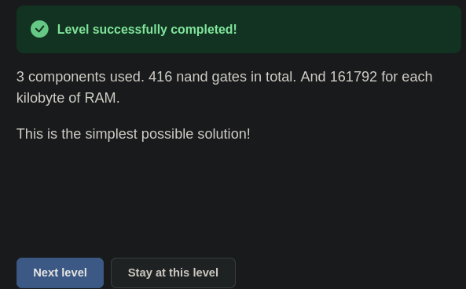

# 🧮 Şalterden Bilgisayara — Combined Memory: A'nın İki İşi

> Bu seviyede önce iki soru soruldu: `st` nereden geliyor, ve seviye tam olarak
> ne istiyor? Devre kuruldu ama bir tel unutuldu; oyun A'ya 7 yerine 0 yazdı.
> Sonra bir deney yapıldı: aynı zilde hem A'ya hem de A'nın gösterdiği adrese
> yazılırsa RAM hangi adrese yazar, eskisine mi yenisine mi? Cevabı görmek için
> RAM'in içine bakmak gerekti. RAM'e bakmanın ise tek bir yolu vardı.

---

## 📋 İçindekiler

- [Bu Parça Ne Yapıyor?](#bu-parça-ne-yapıyor)
- [`st` Nereden Geliyor?](#st-nereden-geliyor)
- [Hangi Adres?](#hangi-adres)
- [Küçük Harf, Büyük Harf](#küçük-harf-büyük-harf)
- [🎮 Şimdi Sen Kur](#-şimdi-sen-kur)
- [Bir Tel Kopuk Kalınca](#bir-tel-kopuk-kalınca)
- [Aynı Zilde A'ya ve RAM'e](#aynı-zilde-aya-ve-rame)
- [RAM'e Nasıl Bakılır?](#rame-nasıl-bakılır)
- [A Hem Veri Hem Adres](#a-hem-veri-hem-adres)
- [Processor Başladı](#processor-başladı)

---

## Bu Parça Ne Yapıyor?

Processor ünitesinin ilk kapısındasın. Manzara şu:

```
girişler:   a · d · *a (1'er bit) · X (16 bit) · cl (1 bit)
çıkışlar:   A · D · *A (16'şar bit)
kutu:       register · ram · nand · inv · and · or · xor
```

Açılan pencere:

> *"Bir işlemci iki tür hafızayı da kullanır: register'ları ve RAM'i. Register'lara
> işlemci doğrudan erişir; ara değerler ve hesaplar için kullanılırlar. RAM çok
> veri saklayabilir, ama bir anda yalnızca tek bir adresten okuyup yazabiliriz.
> Bu işlemcide A ve D adında iki register ve bir RAM bankası var. Bu görevde iki
> register'ı RAM bankasıyla birleştir."*

Girişler:

| giriş | ne |
|---|---|
| `a` | 1 ise `X` A register'ına yazılır |
| `d` | 1 ise `X` D register'ına yazılır |
| `*a` | 1 ise `X` RAM'e, **A register'ının gösterdiği adrese** yazılır |
| `X` | yazılacak 16 bitlik sayı |
| `cl` | zil |

Tanım iki şey daha söylüyor: bayraklar birlikte açılabilir, o zaman `X` aynı anda
birden fazla yere yazılır. Üçü de 0 ise `X` duyulmaz.

Çıkışlar:

| çıkış | ne |
|---|---|
| `A` | A register'ında o an saklanan değer |
| `D` | D register'ında o an saklanan değer |
| `*A` | RAM'de, A register'ının gösterdiği adreste o an saklanan değer |

Tek cümleyle: *bana bir sayı ve hedef ver, zil çalınca oraya yazayım; her an da
A'yı, D'yi ve A'nın gösterdiği RAM hücresini göstereyim.*

Toolbox'taki `ram`, [21](./21_ram.md)'de kurduğun RAM'in bacaklarını taşıyor:
`st`, `X`, `Ad`, `cl`. Fark adres telinde: orada `ad` tek bitti, burada `Ad` 16
bit. [21](./21_ram.md#daha-büyük-ram)'deki kurala göre `n` adres biti `2ⁿ`
sözcüğe numara verebilir: 16 bit, 65536 sözcük.

---

## `st` Nereden Geliyor?

Seviye açılınca ilk soru buydu.

Önce `st`'nin kendisini hatırla. [19](./19_register.md)'dan: `st`, register'ın
kendi bacağı. Anlamı "yazılsın mı?": `st = 1` iken zil `X`'i içeri alır,
`st = 0` iken register eski değerini korur.

Bacak tek başına bir şey yapmaz, onu bir tel beslemeli. Hangi tel? İhtiyaçtan
başla: `X`'i üç hedeften birine ya da birkaçına yazmak istiyoruz. Her hedefin
kendi `st`'si var. Demek ki her `st` için "bu hedef yazsın mı?" sorusunu
cevaplayan bir tel lazım.

Giriş tablosuna tekrar bak: "`a`: 1 ise `X` A register'ına yazılır." Bu cümle,
"`a` teli A'nın `st`'sine gider" demenin başka bir yolu.

```
a    ──►  A register'ının st'si
d    ──►  D register'ının st'si
*a   ──►  ram'in st'si
X    ──►  üçünün de X'i
cl   ──►  üçünün de cl'si
```

> 🔑 **Bayrak, bir `st` telidir.** "`a`: X'i A'ya yaz" ile "`a` → A'nın `st`'si"
> aynı cümle.

21 ile farkına bak. [21](./21_ram.md#yazarken-dağıt)'de tek bir `st` vardı ve
adrese göre iki register'dan birine **yönlendirilmesi** gerekiyordu; bunu `switch`
yapıyordu. Burada her hedefin kendi bayrağı var. Hangi hedefin yazacağına
bayrakları açan taraf karar veriyor. Yönlendirecek bir şey kalmıyor, bu yüzden
`switch` da yok.

`X` ile `cl` ise üçüne birden gidiyor. Kural 21'deki gibi: `X`'in kapıya kadar
gelmesi sorun değil, onu yalnızca `st`'si 1 olan alıyor.

---

## Hangi Adres?

RAM'in bir bacağı daha var: `Ad`, yani "hangi hücre?" Cevap çıkış tablosunda
saklı: `*A` = "RAM'de, **A register'ının gösterdiği adresteki** değer." RAM hep
A'nın gösterdiği hücreye bakacaksa `Ad`'ye A register'ının çıkışı bağlanır.

A register'ının çıkışı artık **iki yere** gidiyor: üstteki `A` çıkışına ve RAM'in
`Ad`'ine. Bir çıkıştan birden fazla tel çekmek serbest.

RAM'in kendi çıkışı da `*A`'ya gidiyor. Yani RAM'in A ile ilgili iki teli var,
ama işleri ayrı:

```
Ad     ←  A register'ının çıkışı     "hangi hücreye bakayım?"
çıkış  →  *A                         "o hücrede ne var?"
```

---

## Küçük Harf, Büyük Harf

Seviyede aynı harf dört yerde geçiyor:

| yazım | ne | yönü |
|---|---|---|
| `a` | A'ya yazma izni | giriş |
| `A` | A register'ında ne var | çıkış |
| `*a` | RAM'e, A'nın gösterdiği adrese yazma izni | giriş |
| `*A` | RAM'de, A'nın gösterdiği adreste ne var | çıkış |

> ⚠️ **Küçük harf yazma izni, büyük harf okunan değer.** `*a` RAM'in `st`'sine
> gider, `*A` RAM'in çıkışından gelir. `*` işaretini "A'nın gösterdiği yer" diye
> oku.

---

## 🎮 Şimdi Sen Kur

Parça listesi: **2 × `register`**, **1 × `ram`**. Kapılara gerek yok.

Bir register A olacak, öbürü D. Bitirdiğinde her giriş bacağına bir tel gelmiş
olmalı: iki register'da 3'er, `ram`'de 4, toplam **10**. Üstteki üç çıkışın her
birine de bir tel.

### Nasıl test edersin

**Reset state** ile başla: register'lar da RAM de 0'lanır. Her satırda önce
ayarları yap, sonra zili çal (`cl` 1, sonra 0).

| adım | ayar | `A` | `D` | `*A` | ne sınanıyor |
|---|---|---|---|---|---|
| 1 | `X = 5`, `a = 1` | 5 | 0 | 0 | A'ya yazıldı. `*A` artık RAM[5]'i gösteriyor: boş |
| 2 | `X = 7`, `a = 0`, `*a = 1` | 5 | 0 | **7** | RAM[5]'e yazıldı, A değişmedi |
| 3 | `X = 3`, `*a = 0`, `d = 1` | 5 | **3** | 7 | D'ye yazıldı |
| 4 | `X = 9`, `d = 0`, `a = 1` | 9 | 3 | **0** | A 9'a geçti. `*A` artık RAM[9]'u gösteriyor: boş |
| 5 | `X = 5` | 5 | 3 | **7** | A 5'e döndü. RAM[5]'teki 7 yerinde duruyor |
| 6 | `X = 1`, `a = 0` | 5 | 3 | 7 | üç bayrak da 0: `X` duyulmadı |

Adım 4 ile 5'e bak: `*A`'nın gösterdiği değer, A nereyi gösteriyorsa ona göre
değişiyor.

<details>
<summary>🔑 Takıldıysan — bağlantı listesi</summary>

```
A register:   st ← a     X ← X    cl ← cl                         →  A,  ram'in Ad'i
D register:   st ← d     X ← X    cl ← cl                         →  D
ram:          st ← *a    X ← X    cl ← cl    Ad ← A register'ı    →  *A
```

</details>

Oyunun cevabı:

> *"3 components used. 416 nand gates in total. And 161792 for each kilobyte of
> RAM. This is the simplest possible solution!"*

416 iki register'ın payı: 2 register × 16 bit × 13 nand.
[19](./19_register.md)'da bir bitlik flip-flop 13 nand sayılıyordu. RAM ayrı
sayılıyor: kilobayt başına 161792.


*Geçen devre. Soldaki register A, sağdaki D. Ortadaki `ram`'in `Ad`'ine A'nın çıkışı geliyor.*


*Seviye geçti.*

---

## Bir Tel Kopuk Kalınca

İlk denemede oyun şu raporu verdi:

> *"1. `a = 1` ve `X = 7` yap. A register'ında 7 saklanmalı.
> 2. `cl = 1`: zil.
> 3. `cl = 0`: zil tamamlandı. Saklanan sayı artık `A`'da görünmeli.
> Beklenen `A` çıkışı 7, ama 0'dı."*

0 iki şey demek olabilir: A hiç yazmadı (`st` ya da `cl` kopuk) ya da yazdı ama
0 yazdı (`X` kopuk). Rapor ikisini ayırmıyor. Ayırmanın yolu A register'ının
bacaklarını tek tek izlemek:

| bacak | durum |
|---|---|
| `st` | `a`'dan geliyor ✓ |
| `cl` | `cl`'den geliyor ✓ |
| çıkış | `A`'ya ve RAM'in `Ad`'ine gidiyor ✓ |
| `X` | **tel yok** ✗ |


*İlk deneme. Alttaki `X` girişinden çıkan tel RAM'e ve sağdaki register'a gidiyor, soldakine gitmiyor.*

> 🎮 **Oyun burada kolaylaştırıyor:** bağlanmamış bir giriş 0 sayılıyor. Bu yüzden
> hata sessiz kaldı: devre bir yeri kırılmış gibi davranmadı, yalnızca beklenen
> sayı gelmedi. **Gerçekte:** boşta kalan giriş 0 değildir, değeri tanımsızdır.
> [08](./08_increment.md#-şimdi-sen-kur)'de `add 16`'nın `B` bacağı bilerek boşta
> bırakılmıştı; orada da not düşülmüştü: gerçek bir devrede boşta kalan giriş
> [01.5](./01.5_yasak_bolge.md)'teki yasak banda, yani 0 ile 1 arasındaki,
> ne 0 ne 1 sayılan gri bölgeye de düşebilir.

> 💡 Check solution'a basmadan önce giriş bacaklarını say. Bu devrede 10 tane var;
> 10 tel saymıyorsan biri kopuk.

---

## Aynı Zilde A'ya ve RAM'e

Tanım "bayraklar birlikte açılabilir" diyor. Peki `a` ile `*a` birlikte açılırsa
ne olur? `X` hem A'ya yazılacak, hem de RAM'e, **A'nın gösterdiği adrese.** Ama
A'nın kendisi de o zilde değişiyor. RAM hangi adrese yazar: A'nın eski değerine
mi, yeni değerine mi?

Seviye açıkken denendi. Değerler bilerek farklı seçildi: eski adres 5, yeni değer 9.

| adım | ayar | zil | `A` | `Ad` | gözlem |
|---|---|---|---|---|---|
| 1 | Reset state; `X = 5`, `a = 1` | `cl` 1, sonra 0 | 5 | 5 | RAM[5] = 0 |
| 2 | `X = 9`, `*a = 1` | `cl = 1` | **5** | **5** | A'nın çıkışı hâlâ 5 |
| 3 | | `cl = 0` | 9 | 9 | RAM[9] = **0**: yeni adrese yazılmadı |
| 4 | `*a = 0`, `X = 5` | `cl` 1, sonra 0 | 5 | 5 | `*A` = **9**: RAM[5] = 9 |


*Adım 2, `cl = 1`. A register'ının çıkışı da RAM'in `Ad`'i de hâlâ 5.*


*Adım 4. A 5'e döndü, `*A` 9 gösteriyor: 9, eski adrese yazılmış.*

**RAM eski adrese yazdı.**

Sebebi [18](./18_data_flip_flop.md)'deki kural: register'ın çıkışı yalnızca `cl`
1'den 0'a indiği anda değişir. `cl = 1` boyunca A'nın çıkışı eski değerinde, 5'te
kalıyor. RAM de yazacağı yeri bu süre boyunca `Ad`'den, yani A'nın eski
değerinden okuyor. [20](./20_counter.md#döngü-artık-bir-kez-döner)'deki döngüyle
aynı durum: orada `inc 16` zil boyunca register'ın eski değerine bakıyordu,
burada RAM A'nın eski değerine bakıyor.

Bu oyunun bir kolaylığı değil; oyunu açmadan da bulunabilir. [21](./21_ram.md)'de
kurduğun RAM'de her sözcük bir register'dı ve `st`'si `switch`'ten geliyordu.
[18](./18_data_flip_flop.md#alıcı-ile-vitrin)'de de register'ın içindeki her
flip-flop'un alıcı kapısı, yani yeni gelen değeri alan yarının kapısı
`and(st, cl)` idi. 9 numaralı sözcüğün kapısını izle:

```
cl = 1 boyunca:   Ad = 5   →   9'un st'si 0   →   and(0, 1) = 0   kapı kapalı
cl inince:        Ad = 9   →   9'un st'si 1   →   and(1, 0) = 0   kapı yine kapalı
```

9'un kapısının açılabileceği bir an yok. Oyunun `ram` kutusu da aynı sonucu verdi.

> 🔑 **Zil boyunca herkes eski değerlere bakar.** Bir register'ın yeni değeri
> ancak zil inince görünür. Aynı zilde hem A'ya hem `*A`'ya yazarsan RAM, A'nın
> **eski** gösterdiği adrese yazar.

> 💡 Bu deneyi kendin yaparken değerleri farklı seç. Aynı sayıyı hem adres hem
> veri olarak kullanırsan (A = 5 iken `X = 5`) RAM'de gördüğün 5'in nereden
> geldiğini ayırt edemezsin. Deneyin ortasında Reset state'e de basma: A'daki
> adresi de siler.

---

## RAM'e Nasıl Bakılır?

Deneyin son adımında RAM[5]'e bakmak gerekiyordu. Oyunda `ram` kutusunun
üstünde dört satırlık bir tablo var, ama elle kaydırılmıyor: hep `Ad`'nin
gösterdiği adresin çevresini gösteriyor. A 9'dayken tabloda 0008–000b vardı,
0005 görünmüyordu.

Tek yol A'yı 5'e geri götürmekti, bu sefer RAM'e yazmadan (`*a = 0`). A 5
olunca tablo 0005'e döndü, `*A` çıkışı da RAM[5]'i gösterdi.

Tablo oyunun arayüzü, ama yansıttığı şey devrenin kuralı: RAM'in okunduğu tek yer
`*A`, `*A` da yalnızca A'nın gösterdiği hücreyi veriyor.

> 🔑 **RAM'deki bir hücreye bakmanın tek yolu, A'yı o adrese götürmek.**

---

## A Hem Veri Hem Adres

Bir soru daha sorulmuştu: *"Öbür register ne yapacak?"*

D bu seviyede yalnızca saklıyor: `X` → D, D → `D` çıkışı. Başka hiçbir yere
bağlı değil.

A'nın ise iki işi var: bir sayı saklıyor (`A` çıkışı) **ve** RAM'e adres
gösteriyor (`Ad`).

Neden ikinci bir register var? Az önceki deney cevabı veriyor. A'yı 5'ten 9'a
götürdüğünde A'daki 5 gitti. RAM'de başka bir hücreye bakmak için A'yı oraya
götürmek zorundasın; A'da duran sayı da o an kaybolur. A adres göstermekle
meşgulken başka bir sayıyı tutacak bir yer lazım: D.

```
A  →  hem veri hem adres    RAM'e bakmak için oynatılır
D  →  yalnız veri           A oynarken sayıyı tutar
```

---

## Processor Başladı

Ünitenin ilk kapısı açıldı: A, D ve RAM tek bir hafıza kutusunda.

[21.5](./21.5_sayi_mi_komut_mu.md#processora-girerken)'in sonunda üç soru
bırakılmıştı. Üçüncüsüne bu seviyede ilk bakış: `cl` hâlâ dışarıdan geliyor,
Input'taki bir anahtar.

Bir de şunu not et: `a`, `d`, `*a` şimdilik elle açılıyor. 21.5'teki fikirle, bir
sayının bitleri bu tellere bağlansa "`X`'i nereye yaz" kararını o sayı verirdi.

---

## Özet — Aklında Tut

```
☐ Combined Memory: iki register (A, D) ve bir RAM tek kutuda. Bir X, üç olası hedef.
☐ 🔑 Bayrak = st teli: a → A'nın st'si, d → D'nin st'si, *a → ram'in st'si.
☐ X ve cl üçüne birden gider. X'i yalnızca st'si 1 olan alır.
☐ 21'den fark: orada tek st adrese göre yönlendiriliyordu (switch). Burada her hedefin kendi bayrağı var, switch yok.
☐ Bayraklar birlikte açılabilir. Üçü de 0 ise X duyulmaz.
☐ RAM'in Ad'i ← A register'ının çıkışı. RAM'in çıkışı → *A.
☐ A'nın çıkışı iki yere gider: A çıkışına ve RAM'in Ad'ine.
☐ ⚠️ Küçük harf yazma izni (a, *a), büyük harf okunan değer (A, *A). * = "A'nın gösterdiği yer".
☐ Kopuk giriş oyunda 0 sayılır, hata sessiz kalır. Gerçekte boşta kalan giriş tanımsızdır.
☐ Check solution'dan önce giriş bacaklarını say: register 3, ram 4, bu devrede 10.
☐ 🔑 Zil boyunca herkes eski değerlere bakar. a ve *a birlikte açıksa RAM, A'nın ESKİ gösterdiği adrese yazar.
☐ Oyunun kolaylığı değil: 9'un alıcı kapısı and(st, cl). cl inince adres 9'a geçse de and(1, 0) = 0.
☐ Deneyde değerleri farklı seç (5 ve 9). Ortada Reset state'e basma.
☐ 🔑 RAM'deki bir hücreye bakmanın tek yolu A'yı o adrese götürmek. Tablo oyunun arayüzü; Ad'yi izlemesi devrenin kuralını yansıtıyor.
☐ A hem veri hem adres, D yalnız veri. A oynarken sayıyı D tutar.
☐ Çözüm: 3 bileşen, 416 nand (2 × 16 × 13) + kilobayt başına 161792, en basit.
☐ cl bu seviyede hâlâ dışarıdan geliyor.
```

---

## 🔗 İlgili Konular

- [21.5_sayi_mi_komut_mu.md](./21.5_sayi_mi_komut_mu.md) — Kontrol telleri nereden gelir; Processor'a girerken üç soru
- [21_ram.md](./21_ram.md) — Adres; register adres bilmez; `st`'yi `switch` ile yönlendirmek
- [19_register.md](./19_register.md) — `st`: yazılsın mı?
- [18_data_flip_flop.md](./18_data_flip_flop.md) — Çıkış yalnızca `cl` inerken değişir
- [20_counter.md](./20_counter.md) — Zil boyunca eski değere bakmak: döngü bir kez döner
- [08_increment.md](./08_increment.md) — Boşta kalan giriş: oyunda 0, gerçekte tanımsız

---

**Önceki konu:** [21.5_sayi_mi_komut_mu.md](./21.5_sayi_mi_komut_mu.md)
**Sonraki konu:** [23_alu_instruction.md](./23_alu_instruction.md)

*Bu ders, "Şalterden Bilgisayara" serisinin bir parçasıdır. Seri, [nandgame.com](https://nandgame.com) eşliğinde ilerler.*
