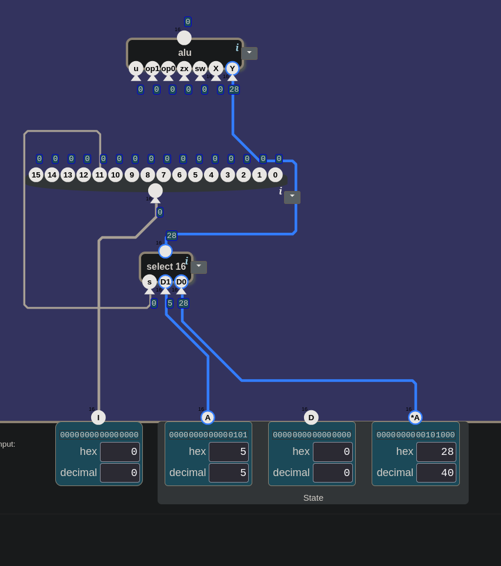
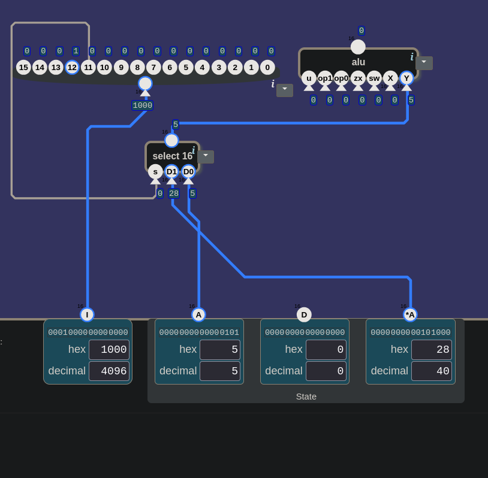
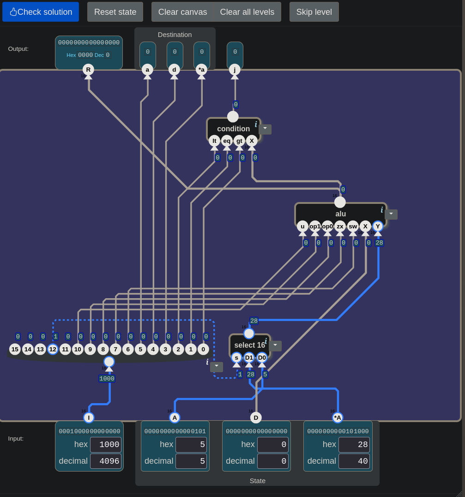
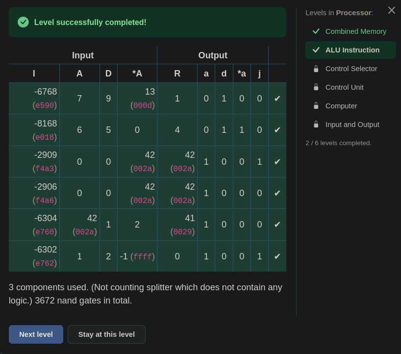
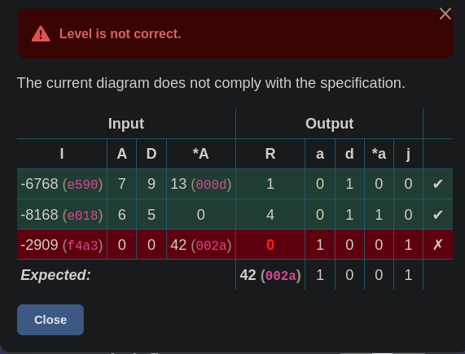
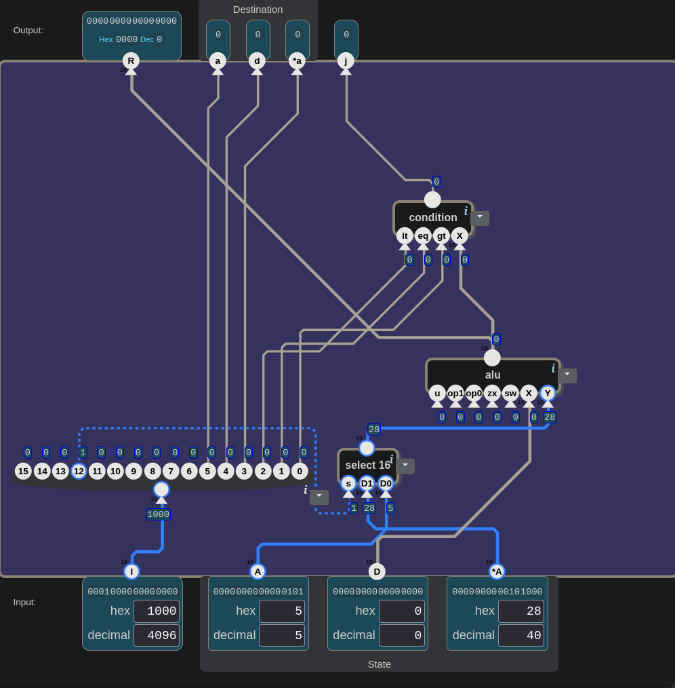

# 🧮 Şalterden Bilgisayara — ALU Instruction: Bir Komut, Üç Cevap

> Bu seviye bir tabloyla açıldı. Önce çıkışların ne olduğu soruldu: R ne, j ne?
> Sonra bir "neden" takıldı: oyun "bit 12" diyor, ama neden 12? Cevap bulunduktan
> hemen sonra bir tel yanlış bacağa gitti, çünkü "12. bit" sıfırdan sayılınca 11'e
> denk geliyordu. İlk Check'te üç test satırından ikisi geçti, biri düştü. Geçen
> iki satırın da aslında tesadüfen geçtiği sonradan anlaşıldı.

---

## 📋 İçindekiler

- [Bu Parça Ne Yapıyor?](#bu-parça-ne-yapıyor)
- [R ve j](#r-ve-j)
- [Komut Tellere Dağılınca](#komut-tellere-dağılınca)
- [Y: A mı, *A mı?](#y-a-mı-a-mı)
- [Neden Bit 12?](#neden-bit-12)
- ["12. Bit" ile "Bit 12"](#12-bit-ile-bit-12)
- [j: Soruyu Kim Cevaplıyor?](#j-soruyu-kim-cevaplıyor)
- [🎮 Şimdi Sen Kur](#-şimdi-sen-kur)
- [Bir Komutu Elle Okumak](#bir-komutu-elle-okumak)
- [Tesadüfen Geçen Testler](#tesadüfen-geçen-testler)
- [Üç Sorudan Biri Cevaplandı](#üç-sorudan-biri-cevaplandı)

---

## Bu Parça Ne Yapıyor?

Processor ünitesinin ikinci seviyesi. Manzara şu:

```
girişler:   I (16 bit, komut) · A · D · *A (16'şar bit)
çıkışlar:   R (16 bit) · a · d · *a · j (1'er bit)
kutu:       nand · alu · condition · 16 bit splitter · and 16 · add 16 · select 16 · inv 16 · 0
```

Açılan pencere:

> *"I, ALU'ya ve condition bileşenine verilen bir komuttur. Bitleri, işlemi
> aşağıdaki gibi yönlendirir:"*

| bit | grup | bayrak |
|:-:|---|---|
| 10 | ALU | `u` |
| 9 | ALU | `op1` |
| 8 | ALU | `op0` |
| 7 | ALU | `zx` |
| 6 | ALU | `sw` |
| 5 | hedef | `a` |
| 4 | hedef | `d` |
| 3 | hedef | `*a` |
| 2 | koşul | `lt` |
| 1 | koşul | `eq` |
| 0 | koşul | `gt` |

> *"ALU'nun X girişi D olmalı. Y girişi ise komuttaki bit 12'ye göre A ya da *A
> olmalı: bit 12 0 ise A, 1 ise *A. R çıkışı ALU işleminin sonucudur. j bayrağı,
> ALU çıkışının bit 0–2'de belirtilen koşullara uyup uymadığını gösterir."*

Ekranda girişler iki grupta duruyor: `I` tek başına, `A`, `D` ve `*A` ise
**State** (durum) başlığının altında. Çıkışlarda `a`, `d` ve `*a`,
**Destination** (hedef) başlığının altında.

Tek cümleyle: *bana bir komut ve üç değer ver; komutun söylediği hesabı yapayım,
sonucu, sonucun nereye yazılacağını ve sonucun koşula uyup uymadığını söyleyeyim.*

> 🔑 **Bu devrede register yok, `cl` de yok.** `A`, `D` ve `*A` dışarıdan geliyor,
> `a`, `d` ve `*a` dışarı gidiyor. Devre hiçbir yere yazmıyor; hesaplıyor ve
> nereye yazılacağını söylüyor.

---

## R ve j

Seviye açılınca ilk soru çıkışlar üzerineydi: *"R gelmiş, j gelmiş, bunlar ne?"*

**R**, İngilizce *result*, yani sonuç: ALU'nun bu komutla yaptığı hesabın çıktısı.
16 bitlik bir sayı.

**j**, İngilizce *jump*, yani atla. Tek bit. Sorduğu soru şu: *"Sonuç, komutun
istediği koşula uyuyor mu?"* Koşulu komutun son üç biti seçiyor:

| bayrak | 1 ise sorulan |
|---|---|
| `lt` | sonuç sıfırdan küçük mü? |
| `eq` | sonuç sıfıra eşit mi? |
| `gt` | sonuç sıfırdan büyük mü? |

[15](./15_condition.md#lt-eq-gt-bir-sayı-değildir)'ten hatırla: bu üç bit bir sayı
değil, üç ayrı soru. Birden fazlası açıksa soru "bunlardan herhangi biri doğru
mu?" olur. Üçü de kapalıysa j hep 0'dır.

Atlama bu seviyede yok. Devre yalnızca "atlanmalı mı?" sorusunun cevabını
üretiyor.

Üçüncü grup **hedef**: `a`, `d`, `*a`. Ne oldukları sorulunca cevap şuydu:
*"R'nin hangi register'a, A'ya mı D'ye mi \*A'ya mı yazılacağını belirliyor."*

Doğru, tek bir düzeltmeyle: `*A` bir register değil, RAM'de A'nın gösterdiği
hücre. [22](./22_combined_memory.md#küçük-harf-büyük-harf)'deki kural burada da
geçerli: küçük harf yazma izni, büyük harf okunan değer.

Böylece üç çıkış grubu üç soruya karşılık geliyor:

```
R            →  sonuç ne?
a · d · *a   →  sonuç nereye yazılacak?
j            →  sonuç koşula uyuyor mu?
```

Hedef bitleri birbirinden bağımsız. Oyunun testlerinden birinde `d` ile `*a`
aynı anda 1'di: sonuç hem D'ye hem de RAM'e yazılacak demek.

---

## Komut Tellere Dağılınca

`I`, 16 bitlik tek bir sayı. Tablo ise her bitin ayrı bir yere gitmesini istiyor:
bit 10 `u`'ya, bit 5 `a`'ya, bit 0 `gt`'ye. Bir sayıyı tellerine ayıran parça
**16 bit splitter**; [10](./10_bayraklar.md#-şimdi-sen-kur)'da ilk kez
kullanılmıştı. Girişine `I` bağlanınca her bacağından bir bit çıkıyor.

[21.5](./21.5_sayi_mi_komut_mu.md#sayı-komut-olunca)'te şu söylenmişti: bir sayının
bitleri kontrol tellerine bağlanırsa o sayı komut olur. Bu seviyede bağlantının
kendisi yapılıyor:

```
I  ──►  splitter  ──►  bit 10–6   →  alu'nun u, op1, op0, zx, sw
                       bit 12     →  Y'nin seçimi
                       bit 5–3    →  a, d, *a
                       bit 2–0    →  condition'ın lt, eq, gt'si
```

Tabloda olmayan bitler de var: 15, 14, 13 ve 11. Bu seviyede hiçbir yere
gitmiyorlar. Bit 12 de tabloda yok, ama pencerenin metninde geçiyor.

---

## Y: A mı, *A mı?

Pencereye göre ALU'nun `Y`'sine bazen A, bazen `*A` gidecek. İkisi arasında neden
seçim var?

A'daki sayı bazen sayının kendisi olarak lazım, bazen RAM'deki bir hücrenin
adresi olarak. [22](./22_combined_memory.md#a-hem-veri-hem-adres)'de A'nın iki işi
olduğunu gördün: hem veri hem adres. Bit 12, komutun bu ikisinden hangisini
istediğini söylüyor. Bir örnek: A = 5 olsun, RAM'in 5 numaralı hücresinde de 40
dursun.

```
bit 12 = 0   →   Y = A    =  5    ALU 5 ile çalışır
bit 12 = 1   →   Y = *A   = 40    ALU 40 ile çalışır
```

İhtiyaç belli: tek bir bit, iki 16 bitlik sayıdan birini seçecek. Parça da
hemen bulundu: *"Seçim yapıyorsak %100 select16 gelecek bu canvas'a."*

Veri girişleri ilk önce şöyle bağlandı:

```
D1  ←  A
D0  ←  *A
```

Sınamak için `A = 5`, `*A = 40` yazıldı, `I` 0'da bırakıldı. `I`'nın bütün bitleri
0 olduğu için `s` de 0'dı. Bit 12 = 0 olduğuna göre `Y`'ye A'daki 5 gelmeliydi.
`Y`'nin altında **28** göründü.

> 💡 Bacakların yanındaki küçük kutular sayıyı onaltılık (hex) gösteriyor. `*A`'nın
> kutusuna bak: hex 28 = decimal 40. Yani `Y`'ye gelen 40'tı, yani `*A`.

Sebep `select 16`'nın kutularında görünüyordu: `s = 0`, `D1 = 5`, `D0 = 28`,
çıkış 28. `s = 0` iken D0 geçiyor, D0'da da `*A` vardı.


*İlk bağlantı. `s` 0 iken `select 16` D0'daki 28'i, yani `*A`'yı geçiriyor.*

> ⚠️ **Kol 0 iken geçmesi gereken şey D0'a bağlanır.**
> [13](./13_arithmetic_unit.md#tuzak-d0-ve-d1-sadece-soket-adıdır)'teki tuzak: D0
> ve D1 yalnızca soket adı. Bit 12 = 0 iken A istendiği için A → D0, `*A` → D1.

Düzeltince aynı denemede `Y` 5 oldu.

---

## Neden Bit 12?

Pencere "bit 12'ye göre" diyor ama nedenini söylemiyor. Seviyede tam bu soru
soruldu: *"Oyun bunu diyor ama neden?"*

Bu soruya bir soruyla cevap arandı: *12 yerine tablodaki boş bitlerden biri, 11
seçilseydi devre çalışır mıydı?* Cevap: *"Çalışırdı. Önemli olan telin nereye
gittiği."*

Doğru. Hangi bitin neye bağlanacağı fizik değil, bir **sözleşme**. Tek şartı var:
komutu yazan ile devreyi kuran aynı sözleşmeyi bilmeli. Devre 11'e bakarken komut
seçimi 12'ye koyarsa ALU yanlış sayıyla çalışır. Üstelik hiçbir şey bozulmuş gibi
görünmez; yalnızca sonuç yanlış çıkar.

> 🔑 **Bitin numarası bir sözleşmedir.** Anlam telin gittiği yerden gelir. İki taraf
> aynı tabloyu kullandığı sürece hangi numaranın seçildiği önemli değil.

[14](./14_alu.md#aynı-tel-çifti-ayrı-sözleşmeler)'te aynı tel çiftinin iki
üniteye iki ayrı şey söylediğini görmüştün. Burada da anlamı tel değil, telin
gittiği yer belirliyor.

---

## "12. Bit" ile "Bit 12"

Cevap bulunduktan hemen sonra `select 16`'nın `s`'si splitter'ın **11** numaralı
bacağına bağlandı. Gerekçesi: *"12. bit olarak 11'e bağladım, 0'dan başladığı
için."*

Mantık yerinde, sorun dilde. Oyun İngilizcede *bit 12* diyor, yani **adı 12 olan
bit**. Türkçede "12. bit" diye yazılınca ise "on ikinci bit" diye okunuyor.
[10](./10_bayraklar.md)'dan hatırla: bitler sağdan sola, bit 0'dan başlayarak
numaralanır. Bu yüzden on ikinci bitin adı 11. Aynı yazı iki ayrı bacağı
gösterebiliyor.

Hangisinin doğru olduğunu oyun gösterdi. `I`'nın hex kutusuna `1000` yazıldı. Bu
sayının ikilik hâli `0001 0000 0000 0000`: yalnızca bit 12 açık.

| | splitter'da 12 | splitter'da 11 | `s` | `Y` |
|---|:-:|:-:|:-:|:-:|
| beklenen | 1 | 0 | 1 | `*A` (40) |
| görülen | **1** | 0 | **0** | **A (5)** |

Splitter'da üzerinde 12 yazan bacak 1 oldu. `s` 11'e bağlı olduğu için 0 gördü ve
`select` A'yı geçirdi.


*`I` = hex 1000. Splitter'da 12 yazan bacak 1, ama `s` 11'e bağlı ve 0 görüyor; `Y`'ye A'daki 5 geliyor.*

> ⚠️ **Splitter'daki numaralar bacakların adıdır.** "Bit 12" doğrudan üzerinde 12
> yazan bacak. Sıfırdan sayınca o, on üçüncü bit.

Az önceki sözleşme fikri burada da geçerli: saymaya 0'dan mı 1'den mi
başlanacağı da sözleşmenin bir maddesi. Tel 11'e bağlandı, oyunun testi 12'ye
baktı. İki taraf farklı saydığı için sonuç yanlış çıktı. Bir birimlik bu kaymanın
yaygın adı *off-by-one*.

`s` 12'ye taşınınca aynı denemede `Y`'nin altında 28 göründü: hex 28, yani 40,
yani `*A`.

---

## j: Soruyu Kim Cevaplıyor?

İhtiyaç: içeri bir sayı ve üç koşul biti giriyor, dışarı tek bir evet ya da hayır
çıkıyor. Parçaların bacak adlarına bakınca cevap çıktı: `condition`. Bacakları
`lt`, `eq`, `gt` ve `X`; [15](./15_condition.md)'te kurduğun parça.

Bir ara şu soru soruldu: *"Condition burada sorulan soruyu j'ye ileten parça mı
olacak?"* Küçük bir fark var: condition soruyu iletmiyor, **cevaplıyor**.

```
soru    ←  komuttan:   bit 2, 1, 0   →   lt, eq, gt
sayı    ←  ?           X
cevap   →  j
```

Geriye tek bir soru kaldı: soru hangi sayıya soruluyor? Cevap: *"ALU'dan gelecek,
değil mi?"* Evet. Pencere de aynı şeyi söylüyor: "ALU çıkışının koşullara uyup
uymadığı." Yani `condition`'ın `X`'ine ALU'nun çıkışı gelir.

ALU'nun çıkışı böylece **iki yere** gidiyor: `R`'ye ve `condition`'ın `X`'ine.
[22](./22_combined_memory.md#hangi-adres)'de A register'ının çıkışı da iki yere
gidiyordu; bir çıkıştan birden fazla tel çekmek serbest.

> 🔑 **Condition soruyu iletmez, cevaplar.** Soru komuttan, sayı ALU'dan gelir,
> cevap j'ye gider.

---

## 🎮 Şimdi Sen Kur

Parça listesi: **1 × `alu`**, **1 × `condition`**, **1 × `select 16`**,
**1 × `16 bit splitter`**.

Bitirdiğinde her giriş bacağına bir tel gelmiş olmalı: `alu`'da 7, `condition`'da
4, `select 16`'da 3, splitter'da 1, toplam **15**. Üstteki beş çıkışın (`R`, `a`,
`d`, `*a`, `j`) her birine de bir tel.

### Nasıl test edersin

Önce `Y`'nin seçimini sına, sonra komutun tamamını. `I`'yı hex kutusuna yaz.

| adım | `I` (hex) | `A` | `D` | `*A` | bak | beklenen | ne sınanıyor |
|---|---|---|---|---|---|---|---|
| 1 | `0000` | 5 | 0 | 40 | `alu`'nun `Y`'si | 5 | bit 12 = 0 → A |
| 2 | `1000` | 5 | 0 | 40 | `alu`'nun `Y`'si | 28 (hex, yani 40) | bit 12 = 1 → `*A` |
| 3 | `f4a3` | 0 | 0 | 42 | `R` · `a d *a` · `j` | 42 · 1 0 0 · 1 | tam komut, aşağıda elle okunuyor |
| 4 | `f4a6` | 0 | 0 | 42 | `R` · `a d *a` · `j` | 42 · 1 0 0 · 0 | aynı hesap, başka koşul |
| 5 | `e762` | 1 | 2 | `ffff` | `R` · `a d *a` · `j` | 0 · 1 0 0 · 1 | sıfır koşulu |

3–5. satırlar oyunun kendi testlerinden. 5. satırda `*A`'ya hex `ffff`, yani −1
yazılır.

<details>
<summary>🔑 Takıldıysan — bağlantı listesi</summary>

```
splitter:    giriş ← I
alu:         u ← bit 10    op1 ← bit 9    op0 ← bit 8    zx ← bit 7    sw ← bit 6
             X ← D         Y ← select 16'nın çıkışı                   →  R,  condition'ın X'i
select 16:   s ← bit 12    D1 ← *A        D0 ← A                      →  alu'nun Y'si
condition:   lt ← bit 2    eq ← bit 1     gt ← bit 0    X ← alu'nun çıkışı  →  j
çıkışlar:    a ← bit 5     d ← bit 4      *a ← bit 3
```

</details>

Oyunun cevabı:

> *"3 components used. (Not counting splitter which does not contain any logic.)
> 3672 nand gates in total."*

Splitter sayılmıyor, çünkü içinde mantık yok: yalnızca bir sayıyı tellerine
ayırıyor. Sayılan üç parça `alu`, `condition` ve `select 16`.


*Geçen devre. Splitter'dan çıkan teller alu'nun kontrol bacaklarına, `select 16`'nın `s`'sine, hedef çıkışlarına ve `condition`'a gidiyor.*


*Seviye geçti.*

---

## Bir Komutu Elle Okumak

Devre kurulunca bir komut elle de okunabilir. Oyunun testlerinden biri:
`I = f4a3`, `A = 0`, `D = 0`, `*A = 42`.

Önce hex'i ikiliğe aç. Her hex hanesi dört bit:

```
   f      4      a      3
 1111   0100   1010   0011
 ↑                       ↑
 bit 15                  bit 0
```

Sonra tabloyla oku:

| bit | değer | gittiği yer | anlamı |
|:-:|:-:|---|---|
| 12 | 1 | `select`'in `s`'si | `Y` = `*A` = 42 |
| 10 | 1 | `u` | aritmetik |
| 9 | 0 | `op1` | toplama |
| 8 | 0 | `op0` | ikinci sayı `Y` |
| 7 | 1 | `zx` | soldaki sayı 0 olur |
| 6 | 0 | `sw` | yer değiştirme yok |
| 5 | 1 | `a` | sonuç A'ya yazılacak |
| 4 | 0 | `d` | |
| 3 | 0 | `*a` | |
| 2 | 0 | `lt` | |
| 1 | 1 | `eq` | sonuç sıfır mı? |
| 0 | 1 | `gt` | sonuç sıfırdan büyük mü? |

Hesap: `zx` soldaki sayıyı, yani D'yi 0 yapıyor. İşlem toplama, ikinci sayı `*A`:
0 + 42 = **42**. Koşul "sıfır ya da sıfırdan büyük mü?": 42 büyük, **j = 1**.
Oyunun beklediği de buydu: `R = 42`, `a = 1`, `j = 1`.

Bit 15, 14 ve 13 bu komutta 1, bit 11 ise 0. Bu devre onlara bakmıyor.

---

## Tesadüfen Geçen Testler

İlk Check'te oyun şu tabloyu verdi:

| `I` | `A` | `D` | `*A` | `R` | `a` | `d` | `*a` | `j` | |
|---|---|---|---|---|---|---|---|---|---|
| `e590` | 7 | 9 | 13 | 1 | 0 | 1 | 0 | 0 | ✔ |
| `e018` | 6 | 5 | 0 | 4 | 0 | 1 | 1 | 0 | ✔ |
| `f4a3` | 0 | 0 | 42 | **0** | 1 | 0 | 0 | 1 | ✗ |
| *beklenen* | | | | **42** | 1 | 0 | 0 | 1 | |


*İlk Check. Kırmızı tek hücre üçüncü satırın `R`'si.*

Yalnızca tek bir hücre yanlış: üçüncü satırın `R`'si. `R` doğrudan ALU'nun çıkışı,
bu yüzden bakılacak yer ALU'ydu. Bacaklarına tek tek bakıldı: tel yalnızca `X`'e ve
`Y`'ye geliyordu. `u`, `op1`, `op0`, `zx` ve `sw` boştaydı.


*İlk deneme. Splitter'dan çıkan teller hedeflere ve `condition`'a gidiyor; alu'nun `u`, `op1`, `op0`, `zx`, `sw` bacaklarına tel yok.*

Boştaki bacak oyunda 0 sayılıyor; [22](./22_combined_memory.md#bir-tel-kopuk-kalınca)'deki
🎮 kutusunda bunun gerçekte neden böyle olmadığı yazıyor. Beş kontrol teli de 0
olunca ALU her komutta aynı işlemi yaptı: `u = 0` mantık, `op1 op0 = 0 0` and. Yani
her komutta `D and Y`.

Peki ilk iki satır neden geçti?

| satır | komutun istediği | devrenin yaptığı | sonuç |
|---|---|---|---|
| `e590` | `zx` ve `op0`: 0 + 1 | 9 and 7 | ikisi de **1** |
| `e018` | 5 and 6 | 5 and 6 | ikisi de **4** |
| `f4a3` | `zx`: 0 + 42 | 0 and 42 | 42 ≠ **0** |

İlk satır tesadüf: 9 (`1001`) and 7 (`0111`) = 1, istenen 0 + 1 de 1. İkinci satır
zaten and istiyordu. Üçüncü satırda tesadüf bitti. Aynı satırın `j`'si bile
tesadüfen doğru çıktı: koşul "sıfır ya da büyük", 0 da 42 de buna uyuyor.

> 🔑 **Testin geçmesi devrenin doğru olduğunu göstermez.** Yalnızca o satırlarda
> yanlışın görünmediğini gösterir.

> 💡 Check solution'a basmadan önce giriş bacaklarını say: bu devrede 15 tane var.
> Beş kontrol teli eksikken devre ilk iki testi geçebiliyordu.

Kontrol telleri tablodaki bit 10–6'ya bağlanınca altı test satırının hepsi geçti.

---

## Üç Sorudan Biri Cevaplandı

[21.5](./21.5_sayi_mi_komut_mu.md#processora-girerken)'in sonunda üç soru
bırakılmıştı. Durum şu:

1. *Bellekte arka arkaya duran komutları sırayla okumak için hangi sayıyı kim
   tutmalı?* Henüz açık.
2. *Bir komutun bitleri hangi tellere gidecek?* Bu seviyenin tablosu: 10–6 ALU'ya,
   12 `Y`'nin seçimine, 5–3 hedeflere, 2–0 koşula.
3. *`cl` ünitenin sonuna kadar dışarıdan mı geliyor?* Bu seviyede hiç `cl` yok.
   Devre bir şey saklamadığı için zile de ihtiyacı yok.

[22](./22_combined_memory.md#processor-başladı)'nin sonunda da şu not düşülmüştü:
`a`, `d`, `*a` şimdilik elle açılıyor; bir sayının bitleri bu tellere bağlansa
"`X`'i nereye yaz" kararını o sayı verirdi. Bu seviyede o bitler belli oldu: 5, 4
ve 3.

---

## Özet — Aklında Tut

```
☐ ALU Instruction: 16 bitlik komut I, ALU'ya ve condition'a ne yapacaklarını söyler.
☐ Üç çıkış grubu, üç soru: R = sonuç ne? · a, d, *a = nereye yazılacak? · j = koşula uyuyor mu?
☐ R = result (sonuç), j = jump (atla). Bu seviyede atlama yok, yalnızca "atlanmalı mı?" cevabı var.
☐ lt, eq, gt üç ayrı soru: sıfırdan küçük mü, eşit mi, büyük mü? Birden fazlası açıksa "herhangi biri".
☐ *A register değil, A'nın gösterdiği RAM hücresi. Küçük harf yazma izni, büyük harf okunan değer.
☐ 🔑 Devrede register ve cl yok: değerleri dışarıdan alır, kararı dışarı verir. Kendisi yazmaz.
☐ 16 bit splitter sayıyı tellerine ayırır. Bit 10–6 → alu, bit 12 → Y'nin seçimi, bit 5–3 → hedef, bit 2–0 → condition. 15, 14, 13, 11 boşta.
☐ Y: bit 12 = 0 → A (sayının kendisi), 1 → *A (A'nın gösterdiği hücre). Seçimi select 16 yapar.
☐ ⚠️ Kol 0 iken geçmesi gereken D0'a: A → D0, *A → D1.
☐ Bacakların yanındaki kutular hex gösterir: 28 = 40.
☐ 🔑 Bitin numarası bir sözleşmedir. Önemli olan telin nereye gittiği; iki taraf aynı tabloyu kullanmalı.
☐ ⚠️ "Bit 12" = üzerinde 12 yazan bacak. "12. bit" diye okursan sıfırdan sayınca 11'e kayarsın (off-by-one).
☐ 🔑 Condition soruyu iletmez, cevaplar: soru komuttan (bit 2–0), sayı ALU'dan (X), cevap j'ye.
☐ ALU'nun çıkışı iki yere gider: R'ye ve condition'ın X'ine.
☐ Komutu elle oku: hex → ikilik → tablo. f4a3: zx, toplama, Y = *A → 0 + 42 = 42; eq ve gt → j = 1.
☐ 🔑 Testin geçmesi devrenin doğru olduğunu göstermez. Kontrol telleri boşken ALU hep D and Y yaptı, ilk iki test tesadüfen geçti.
☐ Check'ten önce bacakları say: alu 7, condition 4, select 16 3, splitter 1 = 15.
☐ Çözüm: 3 bileşen (splitter sayılmaz), 3672 nand.
```

---

## 🔗 İlgili Konular

- [22_combined_memory.md](./22_combined_memory.md) — `a`, `d`, `*a` bayrakları; A hem veri hem adres; küçük harf, büyük harf
- [21.5_sayi_mi_komut_mu.md](./21.5_sayi_mi_komut_mu.md) — Bitleri kontrol tellerine bağlanan sayı komut olur
- [15_condition.md](./15_condition.md) — `lt`, `eq`, `gt` üç ayrı soru; condition'ın içi
- [14_alu.md](./14_alu.md) — ALU'nun kontrol bitleri: `u`, `op1`, `op0`, `zx`, `sw`
- [13_arithmetic_unit.md](./13_arithmetic_unit.md) — D0 ve D1 yalnızca soket adı
- [10_bayraklar.md](./10_bayraklar.md) — Bitlerin numaralanması; 16 bit splitter

---

**Önceki konu:** [22_combined_memory.md](./22_combined_memory.md)
**Sonraki konu:** [24_control_selector.md](./24_control_selector.md)

*Bu ders, "Şalterden Bilgisayara" serisinin bir parçasıdır. Seri, [nandgame.com](https://nandgame.com) eşliğinde ilerler.*
