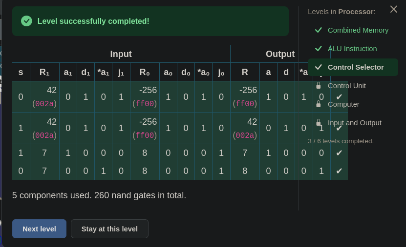
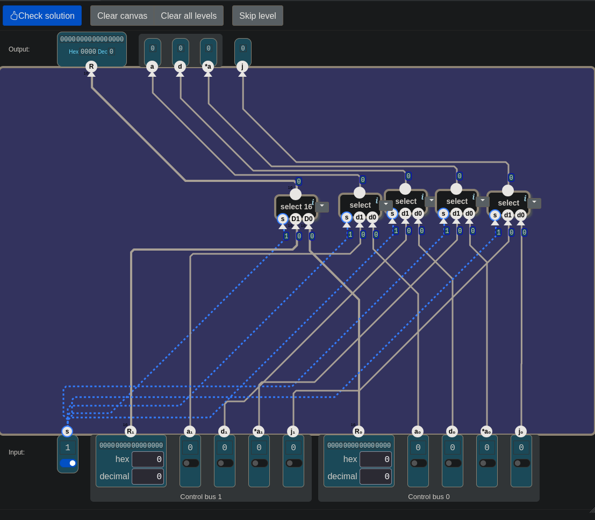

# 🧮 Şalterden Bilgisayara — Control Selector: Tek Kol, İki Paket

> Bu seviye tek bir tabloyla açıldı ve ilk soru şu oldu: buradaki işlem ne? Cevap,
> işlem olmadığıydı. Ardından iki fikir geldi. Birincisi, `a₀`'ı doğrudan `a`'ya
> bağlamaktı. İkincisi, bütün seçicileri tek bir ana `select 16`'da toplamaktı.
> İkisi de aynı yerden düzeldi: `s`'yi yalnızca seçici duyar, ve her çıkışın kendi
> seçicisi olmalı.

---

## 📋 İçindekiler

- [Bu Parça Ne Yapıyor?](#bu-parça-ne-yapıyor)
- [Bir Bus Kaç Tel?](#bir-bus-kaç-tel)
- [Kararı Kim Veriyor?](#kararı-kim-veriyor)
- [Tel s'yi Duymaz](#tel-syi-duymaz)
- [Her Çıkışa Bir Seçici](#her-çıkışa-bir-seçici)
- [Farklı Değerlerle Sına](#farklı-değerlerle-sına)
- [Olmasa Ne Bozulur?](#olmasa-ne-bozulur)
- [🎮 Şimdi Sen Kur](#-şimdi-sen-kur)
- [Neden Gerekli?](#neden-gerekli)

---

## Bu Parça Ne Yapıyor?

Processor ünitesinin üçüncü seviyesi. Manzara şu:

```
girişler:   s (1 bit)
            Control bus 1:  R₁ (16 bit) · a₁ · d₁ · *a₁ · j₁ (1'er bit)
            Control bus 0:  R₀ (16 bit) · a₀ · d₀ · *a₀ · j₀ (1'er bit)
çıkışlar:   R (16 bit) · a · d · *a · j (1'er bit)
kutu:       nand · select · select 16 · 16 bit splitter · is neg
```

Açılan pencere:

> *"s bayrağı, çıkışa gidecek iki giriş takımından birini seçer."*

| `s` | R | `a` | `d` | `*a` | `j` |
|:-:|:-:|:-:|:-:|:-:|:-:|
| 0 | R₀ | a₀ | d₀ | *a₀ | j₀ |
| 1 | R₁ | a₁ | d₁ | *a₁ | j₁ |

> *"Bu basit bir bileşen, ama işlemcide farklı türden komutları destekleyebilmek
> için gerekli."*

Seviye açılınca ilk soru şuydu: *"Buradaki işlem ne?"*

> 🔑 **Bu seviyede hesap yok.** Devre bir şey toplamıyor, karşılaştırmıyor. İki
> takım geliyor, biri geçiyor.

Tabloyu satır satır oku: `s` = 0 iken her çıkış, adının yanında ₀ olan girişi
alıyor; `s` = 1 iken ₁ olanı. Karışık seçim yok. R bus 1'den gelirken `a` bus
0'dan gelemez; takım bütün olarak geçer.

> 💡 Toolbox'ta `is neg` ve `16 bit splitter` da var. Toolbox kullanman gereken
> parçaları değil, kullanabileceğin parçaları gösterir. Pencerede negatif bir sayı
> soran bir şey yok, bir sayıyı tellerine ayırmayı isteyen bir şey de yok.

---

## Bir Bus Kaç Tel?

Ekranın altında girişler iki çerçevede duruyor: **Control bus 1** ve **Control
bus 0**. Seviyede bir an *bus*'ın "telden geçen veri hızı" olduğu sanıldı. Değil.
[21.5](./21.5_sayi_mi_komut_mu.md#teli-takip-et)'te geçmişti: bus, yan yana
çalışan tel demeti, Türkçesiyle **yol**.

Peki bu demette kaç tel var? İlk tahmin 16'ydı. Çerçevenin içini say:

```
Control bus 1:   R₁    a₁    d₁    *a₁    j₁
                 16  + 1   + 1   + 1    + 1    =  20 tel
```

`R₁` 16 bitlik bir sayı, diğer dördü birer bit, yani birer şalter. Bir bus 16
değil, **20 tel**.

İsimler tanıdık: R, `a`, `d`, `*a`, `j`. [23](./23_alu_instruction.md#r-ve-j)'te
kurduğun devrenin çıkışları da bunlardı: sonuç, sonucun nereye yazılacağı ve
koşulun tutup tutmadığı. Bir control bus, bu beş cevabı bir arada taşıyan demet.

---

## Kararı Kim Veriyor?

Bir ara şu cümle kuruldu: *"R, yukarıdaki çıkışlardan hangisini seçeceğine karar
veriyor."*

Karar R'de değil. R çıkışlardan sadece biri, 16 bitlik bir sayı. Hangi takımın
geçeceğine **tek başına `s` karar veriyor**, hem de beş çıkışın hepsi için.

```
s                 →  karar
R, a, d, *a, j    →  kararın sonucu
```

---

## Tel s'yi Duymaz

İlk akla gelen bağlantı şuydu: `a₀`'ı doğrudan `a` çıkışına bağlamak. `s` = 0
iken bu doğru çalışır, çünkü tablo o satırda zaten `a₀` istiyor.

Soru şu: *`s` = 1 olunca `a`'da ne görünür?*

İlk cevap *"bir şey göremem"* oldu. Oysa `a`'da **`a₀`** görünür. Tel `s`'nin
varlığından habersiz; `s` ne olursa olsun `a₀`'ı taşımaya devam eder. Sonuç
boşluk değil, yanlış değerdir.

[12](./12_logic_unit.md#dördü-de-hep-çalışır)'deki `and 16` de böyleydi: `op1`'den
ve `op0`'dan ona tel gelmediği için emirden habersizdi ve AND'lemeye devam
ediyordu.

> 🔑 **Bir tel `s`'yi duymaz.** Toolbox'ta `s`'yi duyan parçalar yalnızca
> seçiciler: `select` ve `select 16`. `s` = 1 iken başka bir girişe geçmesi
> gereken her çıkışın önünde bir seçici olmalı.

---

## Her Çıkışa Bir Seçici

Sıradaki fikir şuydu: birkaç seçiciyle iki bus arasında seçim yapıp hepsini bir
**ana `select 16`**'da toplamak.

Üstteki çıkışlara bak: R, `a`, `d`, `*a` ve `j` beş ayrı soket. `a`'nın R'nin
içinden geçmesi gerekmiyor, bir yerde toplanması da gerekmiyor. Her çıkışın kendi
seçicisi var; ortak olan tek şey kol, yani `s`.

```
                          s
      ┌──────────┬────────┼────────┬─────────┐
      ▼          ▼        ▼        ▼         ▼
  select 16   select   select   select    select
      │          │        │        │         │
      ▼          ▼        ▼        ▼         ▼
      R          a        d        *a        j
```

Hangi seçici hangi boyda olacak? Gerekçe seviyede kuruldu: *"R için 16 bitlik
select kullanırım. Diğerleri için normal select, çünkü onlar birer bit; 16 bitlik
bir şeye gerek yok."*

| çıkış | tel | seçici |
|---|:-:|---|
| R | 16 | `select 16` |
| `a`, `d`, `*a`, `j` | 1'er | `select` (4 tane) |

> 🔑 **Telin genişliği seçicinin boyunu belirler.**

> ⚠️ **`s` = 0 iken bus 0 geçmeli.**
> [13](./13_arithmetic_unit.md#tuzak-d0-ve-d1-sadece-soket-adıdır)'teki tuzak burada
> beş kez var: D0/`d0` ve D1/`d1` yalnızca soket adı. Bus 0 → D0/`d0`, bus 1 →
> D1/`d1`.

---

## Farklı Değerlerle Sına

Check'e basmadan önce devreyi kendin sına.
[13](./13_arithmetic_unit.md#testi-nasıl-seçersin)'teki kuralı hatırla: iyi bir
test, devre bozuk olsaydı bunu fark ettirecek testtir.

Bu devrede en kolay bozulma, bir seçicinin ters bağlanması. İki bus'a **aynı**
değerleri yazarsan ters bağlı bir seçici hiç fark edilmez: hangi bus geçerse
geçsin çıkış aynı görünür. Bu yüzden iki bus'a farklı değerler yaz:

| | Control bus 1 | Control bus 0 |
|---|:-:|:-:|
| R | 2 | 1 |
| `a`, `d`, `*a`, `j` | hepsi 1 | hepsi 0 |

Sonra `s`'yi 0 ile 1 arasında gidip gel:

| `s` | beklenen R | beklenen `a d *a j` |
|:-:|:-:|:-:|
| 0 | 1 | 0 0 0 0 |
| 1 | 2 | 1 1 1 1 |

Oyunun kendi testleri de bu kurala uyuyor. İlk iki satırda iki bus'ın bütün
değerleri birbirinden farklı: R'de 42 ile −256 (hex `ff00`), `a`'da 0 ile 1,
`d`'de 1 ile 0, `*a`'da 0 ile 1, `j`'de 1 ile 0.


*Oyunun testleri. İlk iki satırda iki bus'ın bütün değerleri farklı; ters bağlanmış bir seçici bu satırlarda hemen düşer.*

---

## Olmasa Ne Bozulur?

Bir seçiciyi kaldırırsan ne olur? Diyelim `j`'nin seçicisi yok, `j₀` doğrudan
`j`'ye bağlı. Oyunun dört test satırından hangileri düşer?

Önce tahmin et, sonra aç:

| satır | `s` | j₁ | j₀ | beklenen `j` |
|:-:|:-:|:-:|:-:|:-:|
| 1 | 0 | 1 | 0 | 0 |
| 2 | 1 | 1 | 0 | 1 |
| 3 | 1 | 0 | 1 | 0 |
| 4 | 0 | 0 | 1 | 1 |

<details>
<summary>Cevap</summary>

Seçici yokken `j` her satırda `j₀`'ı gösterir: 0, 0, 1, 1.

| satır | beklenen | görülen | |
|:-:|:-:|:-:|:-:|
| 1 | 0 | 0 | ✔ |
| 2 | 1 | 0 | ✗ |
| 3 | 0 | 1 | ✗ |
| 4 | 1 | 1 | ✔ |

`s` = 0 olan satırlar geçer, çünkü tablo o satırlarda zaten `j₀` istiyor. `s` = 1
olan iki satır düşer. Bu da testin iyi kurulmuş olmasından: `s` = 1 olan bir
satırda `j₁` ile `j₀` aynı olsaydı, eksik seçici o satırda da görünmezdi.

</details>

---

## 🎮 Şimdi Sen Kur

Parça listesi: **1 × `select 16`**, **4 × `select`**.

Bitirdiğinde her seçicinin üç giriş bacağına da bir tel gelmiş olmalı: toplam
**15**. Üstteki beş çıkışın her birine de bir tel. `s` girişinden beş tel çıkar.

<details>
<summary>🔑 Takıldıysan — bağlantı listesi</summary>

```
select 16:   s ← s    D1 ← R₁     D0 ← R₀     →  R
select:      s ← s    d1 ← a₁     d0 ← a₀     →  a
select:      s ← s    d1 ← d₁     d0 ← d₀     →  d
select:      s ← s    d1 ← *a₁    d0 ← *a₀    →  *a
select:      s ← s    d1 ← j₁     d0 ← j₀     →  j
```

</details>

Oyunun cevabı:

> *"5 components used. 260 nand gates in total."*


*Geçen devre. Mavi teller `s`'den beş seçiciye dağılıyor (`s` = 1).*

---

## Neden Gerekli?

Pencere bu parçanın "farklı türden komutları desteklemek için" gerekli olduğunu
söylüyor. Hangi türler? Bunu Processor ünitesinin bir sonraki seviyesi gösterecek.

Fikrin kendisi yeni değil. [14](./14_alu.md#hepsini-üret-sonra-seç)'te ALU,
aritmetik ünite ile mantık ünitesini aynı anda çalıştırıyor, sonucu en sonda `u`
ile seçiyordu. Burada da iki takım aynı anda hazır bekliyor, en sonda `s` birini
geçiriyor.

Fark, seçilen şeyde:

```
ALU               →  iki sonuçtan birini seçer
Control Selector  →  iki paketten birini seçer:
                     sonuç (R) + nereye yazılacağı (a, d, *a) + koşul tuttu mu (j)
```

> 💡 **Gerçek dünyada: MUX.** [11](./11_selector_switch.md#birleştirme-or-neden-güvenli)'de
> seçicinin adını öğrenmiştin: multiplexer, kısaca mux. Oyun laptoplarında **MUX
> switch** denen bir parça, ekranı hangi ekran kartının süreceğini seçer. Panele
> giden teller, bu seviyedeki gibi tek kolla ve takım hâlinde geçer.

---

## Özet — Aklında Tut

```
☐ Control Selector: s, iki giriş takımından birini bütün olarak çıkışa geçirir. Hesap yok.
☐ Bus = yan yana çalışan tel demeti (21.5). Bir hız değil.
☐ Bir control bus 20 tel: R (16) + a, d, *a, j (1'er). Aynı beş isim 23'ün çıkışları.
☐ Kararı R değil s verir; beş çıkışın hepsi için tek kol.
☐ 🔑 Tel s'yi duymaz. Doğrudan bağlanan a₀, s = 1 iken de a₀ taşır: sonuç boşluk değil, yanlış değer.
☐ s'yi duyan parça seçicidir. Her çıkışa bir seçici; ortak olan yalnız s.
☐ 🔑 Telin genişliği seçicinin boyunu belirler: R → select 16, tek bitler → select.
☐ ⚠️ s = 0 iken bus 0 geçer: bus 0 → D0/d0, bus 1 → D1/d1.
☐ İki bus'a farklı değer yazarak sına; aynı değerlerle ters bağlı bir seçici görünmez.
☐ Bir seçici kaldırılırsa yalnız s = 1 satırları düşer, o da iki bus'ın değerleri farklıysa.
☐ ALU iki sonuçtan birini seçiyordu; Control Selector iki paketten birini seçer.
☐ Gerçek dünyada: MUX switch, ekranı hangi ekran kartının süreceğini seçer.
☐ Çözüm: 1 select 16 + 4 select = 5 bileşen, 260 nand.
```

---

## 🔗 İlgili Konular

- [23_alu_instruction.md](./23_alu_instruction.md) — R, `a`, `d`, `*a`, `j`: sonuç, hedef, koşul
- [21.5_sayi_mi_komut_mu.md](./21.5_sayi_mi_komut_mu.md) — Bit = tel; tel demeti = yol (bus)
- [14_alu.md](./14_alu.md) — Hepsini üret, sonra seç
- [13_arithmetic_unit.md](./13_arithmetic_unit.md) — D0 ve D1 yalnızca soket adı; testi nasıl seçersin
- [12_logic_unit.md](./12_logic_unit.md) — Tel gelmeyen kutu emirden habersizdir
- [11_selector_switch.md](./11_selector_switch.md) — Seçici; multiplexer (mux)

---

**Önceki konu:** [23_alu_instruction.md](./23_alu_instruction.md)
**Sonraki konu:** *(yolda — Processor ünitesinin dördüncü seviyesi)*

*Bu ders, "Şalterden Bilgisayara" serisinin bir parçasıdır. Seri, [nandgame.com](https://nandgame.com) eşliğinde ilerler.*
